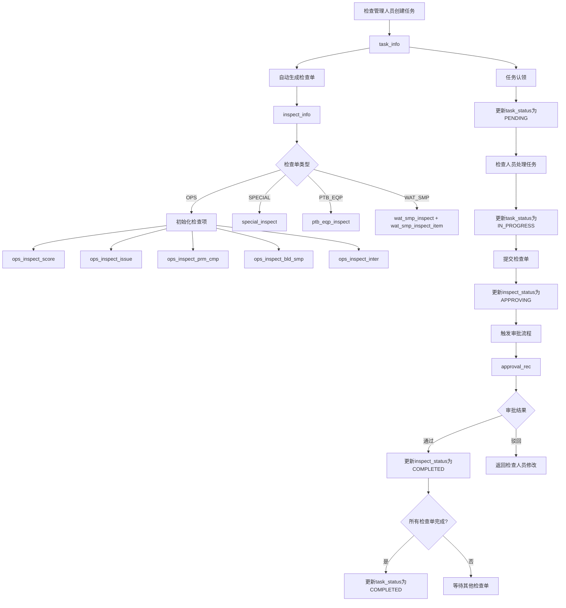
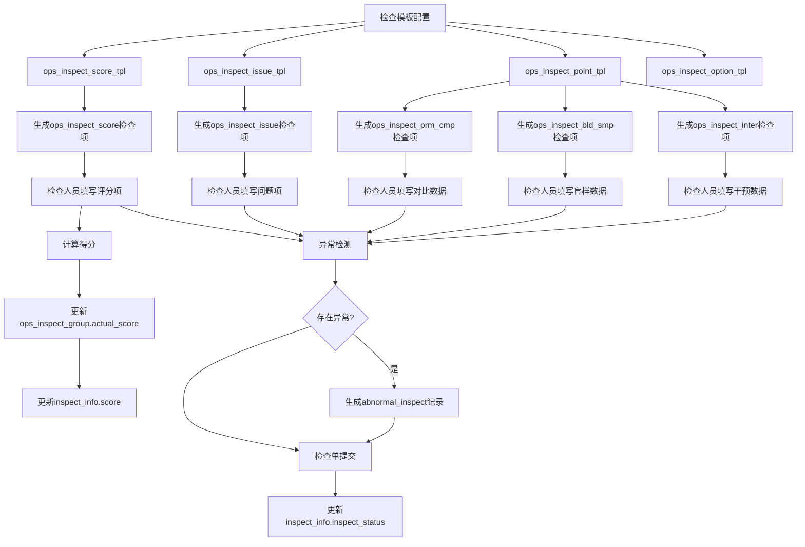
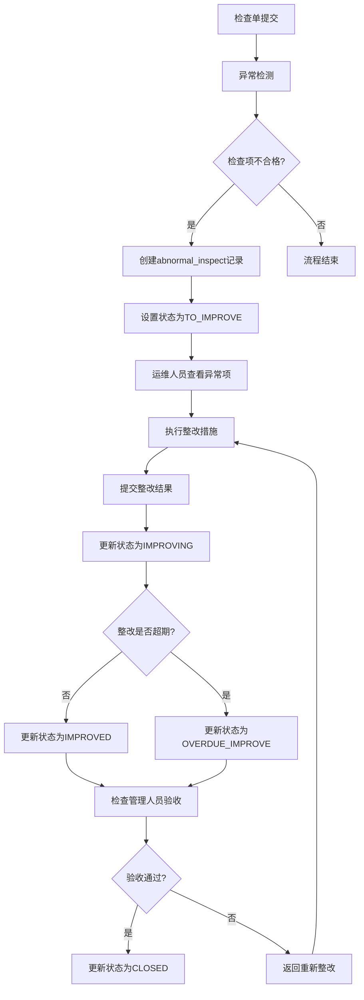
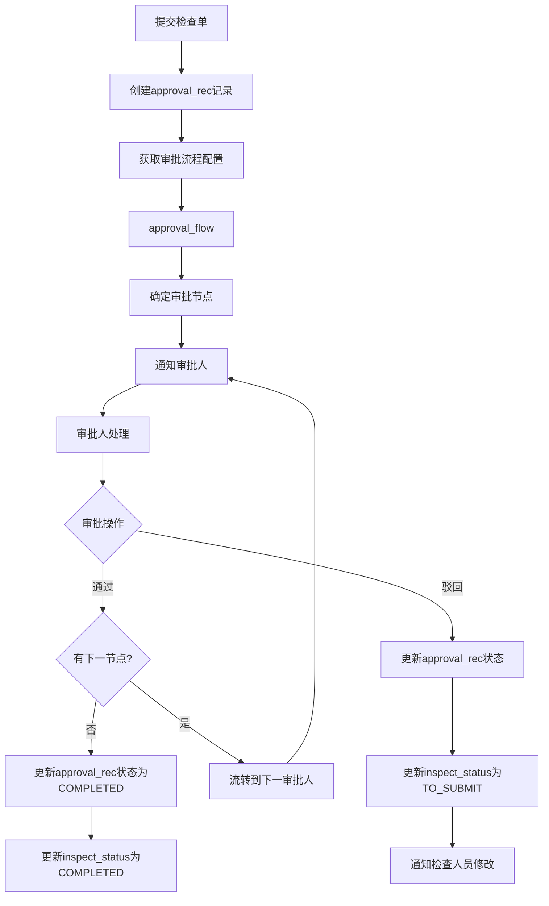

# 核心业务流程

## 文档概述

本文档描述了水质监测站运维检查管理系统的核心业务流程，包括任务发布、检查单处理、审批流程等关键环节，旨在规范系统的业务操作流程。

---

## 1. 任务发布流程

### 1.1 发布计划内任务

计划内任务是指按照预先制定的检查计划进行的周期性检查任务。

**流程步骤：**

1. **创建任务**：检查管理人员根据排期的检查计划发布计划内检查任务
2. **创建检查单**：根据任务类型（现场检查/OPS、专项检查/SPECIAL、飞行检查/FLIGHT）以及检查单模板(现场运维检查/OPS、专项检查/SPECIAL、便携仪器检查/PTB_EQP、水样抽测对比检查/WAT_SMP)，自动生成对应的检查单和检查项
3. **领取任务**：检查人员登录系统查看待认领任务列表，选择任务并认领任务
4. **任务状态更新**：任务发布后状态为 `CLAIMING`（待认领）

**涉及数据表：**

- `task_info` - 存储任务基本信息
- `inspect_info` - 存储检查单信息
- `ops_inspect_score` - 存储运维检查单(评分表单)检查项信息(现场运维检查/OPS)
- `ops_inspect_issue` - 存储环境核查单(问题项表单)检查项信息(现场运维检查/OPS)
- `ops_inspect_prm_cmp` - 存储参数对比检查单(五参数对比和藻类参数对比)检查项信息(现场运维检查/OPS)
- `ops_inspect_bld_smp` - 存储盲样考核检查单检查项信息(现场运维检查/OPS)
- `ops_inspect_inter` - 存储集成干预检查单检查项信息(现场运维检查/OPS)
- `special_inspect` - 存储专项检查信息(专项检查/SPECIAL)
- `ptb_eqp_inspect` - 存储便携仪器检查单信息(便携仪器检查/PTB_EQP)
- `wat_smp_inspect` - 存储水样抽测对比检查单信息(水样抽测对比检查/WAT_SMP)
- `wat_smp_inspect_item` - 存储水样抽测对比检查单检查项信息(水样抽测对比检查/WAT_SMP)

### 1.2 发布计划外任务

计划外任务是指根据特殊需求临时发起的检查任务。

**流程步骤：**

1. **创建任务**：检查管理人员视情况发布计划外检查任务（例如站点现场检查出现异常检查项时）
2. **创建检查单**：根据任务类型（现场检查/OPS、专项检查/SPECIAL、飞行检查/FLIGHT）以及检查单模板(现场运维检查/OPS、专项检查/SPECIAL、便携仪器检查/PTB_EQP、水样抽测对比检查/WAT_SMP)，自动生成对应的检查单和检查项
3. **领取任务**：检查人员登录系统查看待认领任务列表，选择任务并认领任务
4. **任务状态更新**：任务状态为 `CLAIMING`（待认领）

**涉及数据表：**

- `task_info` - 存储任务基本信息
- `inspect_info` - 存储检查单信息
- `ops_inspect_score` - 存储运维检查单(评分表单)检查项信息(现场运维检查/OPS)
- `ops_inspect_issue` - 存储环境核查单(问题项表单)检查项信息(现场运维检查/OPS)
- `ops_inspect_prm_cmp` - 存储参数对比检查单(五参数对比和藻类参数对比)检查项信息(现场运维检查/OPS)
- `ops_inspect_bld_smp` - 存储盲样考核检查单检查项信息(现场运维检查/OPS)
- `ops_inspect_inter` - 存储集成干预检查单检查项信息(现场运维检查/OPS)
- `special_inspect` - 存储专项检查信息(专项检查/SPECIAL)
- `ptb_eqp_inspect` - 存储便携仪器检查单信息(便携仪器检查/PTB_EQP)
- `wat_smp_inspect` - 存储水样抽测对比检查单信息(水样抽测对比检查/WAT_SMP)
- `wat_smp_inspect_item` - 存储水样抽测对比检查单检查项信息(水样抽测对比检查/WAT_SMP)

---

## 2. 任务处理流程

### 2.1 任务认领

**流程步骤：**

1. **查看任务**：检查人员登录系统查看待认领任务列表
2. **认领任务**：检查人员选择任务并确认认领
3. **状态更新**：任务状态从 `CLAIMING` 变更为 `PENDING`（待处理）

### 2.2 任务开始处理

**流程步骤：**

1. **开始检查**：检查人员到达现场后开始打卡并执行检查任务
2. **状态更新**：任务状态从 `PENDING` 变更为 `IN_PROGRESS`（处理中）
3. **填写检查内容**：根据检查单模板填写各项检查内容

### 2.3 任务完成处理

**流程步骤：**

1. **提交检查单**：检查完成后提交检查单，触发检查单审批流程
2. **生成异常项**：系统自动根据检查结果生成异常整改项
3. **状态更新**：当任务关联的所有检查单都进入审批或者审批通过后，任务状态从 `IN_PROGRESS`（处理中） 变更为 `APPROVING`（待审核）
4. **审批通过**：当所有检查单都审批都通过（检查单状态为 `COMPLETED`）后，任务状态变更为 `COMPLETED`（已完成）

**任务状态流转：**

``` flowchart
CLAIMING（待认领） → PENDING（待处理） → IN_PROGRESS（处理中） → APPROVING（待审核） → COMPLETED（已完成）
```

**任务说明备注：**

- 任务信息表为 `task_info`，存储任务基本信息，包括任务ID、任务类型（task_type）、计划类型（plan_type）、任务状态（task_status）、任务日期（或者任务计划日期,检查日期,plan_dt）、任务实际执行日期（实际检查日期,exec_dt）、站点、检查单位、检查人员（任务处理人，任务认领人，inspector_id）、运维单位、运维人员（omer_name）等。
- 任务由检查管理人员发布，会自动关联到检查管理人员所在的检查单位。每个检查管理人员或检查人员只能关联一个检查单位，只能看到该单位的任务。
- 发布任务时，一个任务只能关联一个站点、一个检查单位、一个运维单位、一个运维人员；可以选择创建多个检查单（不同类型的检查单）。
- 任务只能被关联的检查单位的一个检查人员认领，其他检查人员不能处理该任务。
- 任务的完成：需要区分任务的“完成”与任务状态的“已完成”。
  - 任务的“完成”：统计意义上的完成。即任务关联的所有检查单都已提交，处于审批中或已完成的状态，此种情况下可视为任务已完成（尽管有可能检查单还未最终审批通过）。对应的任务状态为`APPROVING`（审核中）或`COMPLETED`（已完成）。
  - 任务状态的“已完成”：任务流程状态的“已完成”。即当所有检查单都审批都通过（检查单状态为 `COMPLETED`）后，任务状态变更为 `COMPLETED`（已完成）。这是任务的最终完成状态。
  - 任务下有任意检查单处于`TO_SUBMIT`（待提交）状态，则任务状态为`IN_PROGRESS`（处理中），表示任务未完成。
  - 注意：如果没有特意强调任务的状态是“已完成”或“完成”，则默认任务的“完成”是指任务统计意义上的“已完成”。
- 任务日期：任务计划日期,计划执行现场检查任务的日期，通常说的任务日期,就是指任务的计划日期，数据库字段为plan_dt. 任务通常是在执行任务检查之前创建的，所以不是指任务的创建日期create_dt; 任务的实际执行日期exec_dt绝大情况与任务计划日期相同,如果没有特别强调任务的实际执行日期, 任务日期就是任务计划日期plan_dt。

---

## 3. 检查单处理流程

### 3.1 检查单创建

**流程步骤：**

1. **检查单类型选择**：发布任务时根据任务类型选择不同的检查单类型，每个被选中的检查单类型生成对应的一个检查单。
2. **检查单初始化**：根据检查单类型初始化检查单内容,包括检查单ID、任务ID、站点、检查单类型、检查单子类型、检查单状态等。
3. **检查单检查项初始化**：仅现场运维检查单（OPS）需要初始化检查项。默认查询现场运维检查项最新版本的模板（ops_inspect_score_tpl, ops_inspect_issue_tpl, ops_inspect_point_tpl），并根据模板初始化检查项(ops_inspect_score, ops_inspect_issue, ops_inspect_prm_cmp, ops_inspect_bld_smp, ops_inspect_inter)。
4. **检查单状态更新**：检查单初始化创建时,状态为 `PENDING`, 任务开始处理时, 检查单状态变更为 `TO_SUBMIT`。

### 3.2 检查单填写

检查人员根据不同检查类型填写相应的检查内容：

| 检查类型 | 检查内容 | 对应数据表 |
| :--- | :--- | :--- |
| 现场运维检查 (OPS) | 运维核查(评分项)、环境核查(问题项核查)、质控检查(检查要点核查) | `ops_inspect_score`, `ops_inspect_issue`, `ops_inspect_prm_cmp`, `ops_inspect_bld_smp`, `ops_inspect_inter` |
| 专项检查 (SPECIAL) | 专项检查内容 | `special_inspect` |
| 便携仪器检查 (PTB_EQP) | 便携仪器准确度检查 | `ptb_eqp_inspect` |
| 水样抽测比对检查 (WAT_SMP) | 抽测比对记录,抽测对比检查项 | `wat_smp_inspect`, `wat_smp_inspect_item` |

### 3.3 检查单提交

**流程步骤：**

1. **验证检查内容**：系统验证必填项是否完整
2. **计算得分**：根据评分项自动计算检查得分(仅现场运维检查单（OPS）的运维核查(评分表, ops_inspect_score)需要计算得分), 每个评分项的得分存于检查分组表ops_inspect_group表的acturl_score字段,检查单的最终得分存于检查单表inspect_info的score字段中。任务的得分指任务下的现场运维检查单的得分。
3. **更新状态**：检查单状态从 `TO_SUBMIT`（待提交）状态变为 `APPROVING`（审批中）
4. **触发审批**：根据配置的审批流程触发相应审批

### 3.4 检查单审核

**流程步骤：**

1. **审批人查看**：审批人员查看检查单内容和检查结果
2. **审批操作**：
   - **通过**：如果没有后续的审批节点，检查单状态变更为 `COMPLETED`（已完成）；如果还有后续的审批节点，检查单状态依然为 `APPROVING`（审批中）。
   - **驳回**：检查单状态变更为 `TO_SUBMIT`（待提交），返回检查人员修改检查内容并重新提交审核。
3. **通知结果**：系统通知检查人员审批结果

**检查单状态流转：**

``` flowchart
PENDING（待处理） → TO_SUBMIT（待提交） → APPROVING（审批中） → COMPLETED（已完成）
```

---

## 4. 异常项处理流程

### 4.1 异常项生成

**触发条件：**

- 现场运维检查单（OPS）存在检查不合格项，只要存在检查不合格项，就会生成异常项。
- 现场运维检查单（OPS）提交时触发检查不合格检查项，并生成对应的异常整改项。

**流程步骤：**

1. **自动检测**：检查单提交时系统自动检测异常项
2. **生成记录**：在 `abnormal_inspect` 表中创建异常项记录
3. **状态初始化**：异常状态为 `TO_IMPROVE`（待整改）

### 4.2 异常项整改

异常项生成后，需要站点运维人员在异常项生成后的7个工作日内整改，并提交整改结果和证据，否则会产生超期整改。

**流程步骤：**

1. **整改执行**：站点运维人员执行整改措施
2. **整改反馈**：站点运维人员提交整改结果和证据,并提交审核。特别说明: 同一个运维单位的所有运维人员共用一个系统账号处理异常项整改。可以通过任务信息表中的omer_name字段来区分不同的运维人员.
3. **验收确认**：检查管理人员验收整改结果,并进行审核.
4. **状态更新**：改善状态由 `TO_IMPROVE`（待整改）变更为 `IMPROVING`（整改中）,再根据整体提交时间判断是否`OVERDUE_IMPROVE`（超期整改）或`IMPROVED`（正常整改）。  

### 4.3 异常项审批

**流程步骤：**

1. **审核异常**：管理人员审核异常项内容
2. **确认异常**：确认异常并制定整改措施
3. **状态更新**：异常状态变更为 `CLOSED`（已关闭）

**异常状态流转：**

``` flowchart
TO_IMPROVE（待整改） → IMPROVING（整改中） → IMPROVED（正常整改） → CLOSED（已关闭）
TO_IMPROVE（待整改） → IMPROVING（整改中） → OVERDUE_IMPROVE（超期整改） → CLOSED（已关闭）
```

---

## 5. 数据流向

### 5.1 任务数据流向



**数据流向说明：**

- 任务创建时，数据写入 `task_info` 表
- 根据任务类型自动创建对应的检查单，写入 `inspect_info` 表
- 现场运维检查单(OPS)会根据模板初始化多个检查项表
- 任务状态流转：`CLAIMING` → `PENDING` → `IN_PROGRESS` → `APPROVING` → `COMPLETED`

### 5.2 检查数据流向



**数据流向说明：**

- 检查模板是检查项的数据源，存储在 `*_tpl` 表中
- 检查人员填写的数据分别写入对应的检查项记录表
- 评分项自动计算得分，更新到 `ops_inspect_group` 和 `inspect_info` 表
- 检查单提交时触发异常检测，不合格项生成异常记录

### 5.3 异常项数据流向



**数据流向说明：**

- 异常项由检查单提交时自动生成，存储在 `abnormal_inspect` 表
- 异常状态流转：`TO_IMPROVE` → `IMPROVING` → (`IMPROVED` 或 `OVERDUE_IMPROVE`) → `CLOSED`
- 整改期限为7个工作日，超期自动标记为 `OVERDUE_IMPROVE`

### 5.4 审批数据流向



**数据流向说明：**

- 审批记录存储在 `approval_rec` 表
- 审批流程配置存储在 `approval_flow` 表
- 支持多节点审批流程
- 审批通过后更新检查单状态为 `COMPLETED`
- 审批驳回后检查单状态回退为 `TO_SUBMIT`

---

## 6. 关键业务规则

### 6.1 任务管理规则

#### 6.1.1 任务创建规则

- 任务分为**计划内任务**和**计划外任务**，通过 `plan_type` 字段区分
- 任务类型包括：现场检查(OPS)、专项检查(SPECIAL)、飞行检查(FLIGHT)
- 一个任务只能关联**一个站点**、**一个检查单位**、**一个运维单位**、**一个运维人员**
- 一个任务可以关联**多个检查单**（不同类型的检查单）

#### 6.1.2 任务分配规则

- 任务发布时自动关联到检查管理人员所在的检查单位
- 每个检查管理人员或检查人员只能关联一个检查单位，只能看到该单位的任务
- 任务只能被关联的检查单位的检查人员认领
- 任务认领后，检查人员负责完成所有关联的检查单

#### 6.1.3 任务状态规则

- **任务状态流转**：`CLAIMING`（待认领）→ `PENDING`（待处理）→ `IN_PROGRESS`（处理中）→ `APPROVING`（审核中）→ `COMPLETED`（已完成）
- 任务下有任意检查单处于 `TO_SUBMIT`（待提交）状态，则任务状态为 `IN_PROGRESS`（处理中）
- 当任务关联的所有检查单都进入审批或审批通过后，任务状态变更为 `APPROVING`（审核中）
- 当所有检查单都审批通过后，任务状态变更为 `COMPLETED`（已完成）

#### 6.1.4 任务日期规则

- 任务计划日期（`plan_dt`）：计划执行现场检查任务的日期
- 任务实际执行日期（`exec_dt`）：实际执行检查的日期，通常与计划日期相同
- 任务创建日期（`create_dt`）：任务创建的时间，与任务日期无关

### 6.2 检查单管理规则

#### 6.2.1 检查单类型规则

- **现场运维检查单(OPS)**：包含运维核查(评分项)、环境核查(问题项)、质控检查(检查要点)
- **专项检查单(SPECIAL)**：专项检查内容
- **便携仪器检查单(PTB_EQP)**：便携仪器准确度检查
- **水样抽测对比检查单(WAT_SMP)**：抽测比对记录

#### 6.2.2 检查单创建规则

- 发布任务时根据任务类型选择检查单类型，每种类型生成一个检查单
- 现场运维检查单(OPS)需要根据最新版本模板初始化检查项
- 检查单初始状态为 `PENDING`，任务开始处理时变更为 `TO_SUBMIT`

#### 6.2.3 检查单填写规则

- 运维核查(评分项)：存储在 `ops_inspect_score` 表
- 环境核查(问题项)：存储在 `ops_inspect_issue` 表
- 参数对比检查：存储在 `ops_inspect_prm_cmp` 表（五参数对比和藻类参数对比）
- 盲样考核检查：存储在 `ops_inspect_bld_smp` 表
- 集成干预检查：存储在 `ops_inspect_inter` 表

#### 6.2.4 检查单提交规则

- 提交前验证所有必填项是否完整
- 自动计算评分项得分，更新到 `ops_inspect_group.actual_score` 和 `inspect_info.score`
- 提交后检查单状态变为 `APPROVING`（审批中）

#### 6.2.5 检查单审核规则

- 审批通过且无后续节点：检查单状态变更为 `COMPLETED`（已完成）
- 审批通过但有后续节点：检查单状态保持 `APPROVING`（审批中）
- 审批驳回：检查单状态变更为 `TO_SUBMIT`（待提交），返回检查人员修改

### 6.3 异常项管理规则

#### 6.3.1 异常项生成规则

- **触发条件**：现场运维检查单（OPS）提交时
- **生成规则**：
  - 评分项得分低于合格标准自动生成异常项
  - 问题项存在不合格内容时自动生成异常项
  - 参数对比检查超出偏差范围自动生成异常项
  - 盲样考核不合格自动生成异常项
  - 集成干预检查不合格自动生成异常项
- 异常记录存储在 `abnormal_inspect` 表，初始状态为 `TO_IMPROVE`（待整改）

#### 6.3.2 异常项整改规则

- 运维人员需在**7个工作日内**完成整改并提交整改结果和证据
- 整改过程中状态变更为 `IMPROVING`（整改中）
- 整改超期自动标记为 `OVERDUE_IMPROVE`（超期整改）
- 同一运维单位的所有运维人员共用一个系统账号处理异常项整改

#### 6.3.3 异常项验收规则

- 检查管理人员验收整改结果并进行审核
- 验收通过：异常状态变更为 `CLOSED`（已关闭）
- 验收不通过：返回运维人员重新整改

### 6.4 数据权限规则

#### 6.4.1 检查单位权限

- 检查人员只能查看和处理本单位的任务
- 检查人员只能查看本单位提交的检查单

#### 6.4.2 运维单位权限

- 运维人员只能查看和处理本单位负责的站点的异常项
- 运维人员可以查看关联任务的检查单信息

#### 6.4.3 审批权限

- 审批人员只能处理自己负责的审批节点
- 审批人员可以查看审批流程相关的检查单和任务信息

### 6.5 时效规则

#### 6.5.1 审批时效规则

- 检查单审批应在**24小时内**完成
- 异常项整改应在**7个工作日内**完成
- 超期未处理的审批和整改会触发提醒通知

#### 6.5.2 数据保留规则

- 任务和检查单数据永久保留
- 异常项记录永久保留
- 审批记录永久保留

### 6.6 数据一致性规则

#### 6.6.1 状态同步规则

- 检查单状态变更时，自动同步更新关联任务的状态
- 异常项状态变更时，自动同步更新关联检查单的异常状态

#### 6.6.2 数据完整性规则

- 检查单删除时，级联删除关联的检查项记录
- 任务删除时，级联删除关联的检查单和异常项记录

#### 6.6.3 版本控制规则

- 所有核心数据表均包含 `ver` 字段用于版本控制
- 数据更新时自动更新版本号
