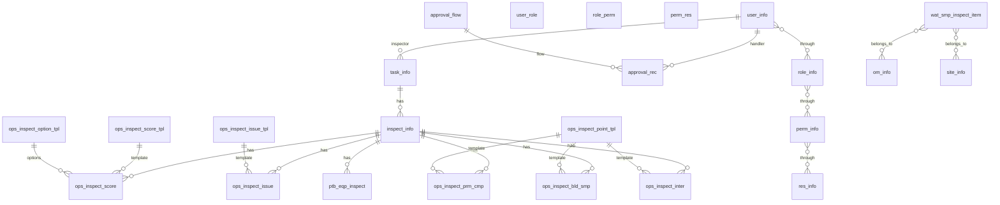

# 数据库设计文档

## 1. 文档概述

本文档描述了水质监测站运维检查管理系统的数据库设计，包括数据库结构、表关系、字段说明等内容。该系统主要用于管理水质监测站的运维检查工作，包括现场运维检查、专项检查、便携仪器检查等多种检查类型，支持检查单创建、审批、异常项生成等功能。

## 2. 数据库设计原则

1. **数据一致性**：确保数据的完整性和一致性，避免数据冗余和数据冲突。
2. **可扩展性**：设计灵活的表结构，支持未来业务需求的扩展。
3. **性能优化**：合理设计索引，提高查询效率。
4. **安全性**：设置适当的用户权限，保护数据安全。
5. **规范化**：遵循数据库设计规范，减少数据冗余。

## 3. 数据库结构设计

### 3.1 数据库初始化

数据库名称：`sz_water`

用户权限设置：

- `data` 用户：拥有所有权限
- `opr` 用户：拥有 SELECT、INSERT、UPDATE、DELETE 权限

### 3.2 表关系图



### 3.3 表的用途和使用场景

| 表名                       | 用途              | 使用场景                  | 数据来源        |
| :----------------------- | :-------------- | :-------------------- | :---------- |
| `task_info`              | 存储检查任务信息        | 任务创建、分配、跟踪            | 系统自动生成或手动创建 |
| `inspect_info`           | 存储检查单信息         | 检查单创建、提交、审批           | 系统自动生成      |
| `ops_inspect_score`      | 存储运维核查(评分检查项记录) | 现场运维检查评分              | 检查人员填写      |
| `ops_inspect_issue`      | 存储环境核查(检查问题项记录) | 现场运维检查问题记录            | 检查人员填写      |
| `ops_inspect_prm_cmp`    | 存储对比检查记录        | 在线设备与便携式设备对比检查        | 检查人员填写      |
| `ops_inspect_bld_smp`    | 存储盲样考核记录        | 盲样考核检查                | 检查人员填写      |
| `ops_inspect_inter`      | 存储集成干预检查记录      | 集成干预检查                | 检查人员填写      |
| `ptb_eqp_inspect`        | 存储便携仪器检查记录      | 便携仪器现场准确度检查           | 检查人员填写      |
| `wat_smp_inspect_item`   | 存储抽测比对记录        | 抽测比对检查                | 实验室分析结果     |
| `ops_inspect_score_tpl`  | 存储运维核查(评分检查项)模板       | 检查项模板管理               | 系统管理员配置     |
| `ops_inspect_option_tpl` | 存储运维检查单选项模板     | 检查项选项管理               | 系统管理员配置     |
| `ops_inspect_issue_tpl`  | 存储环境核查检查项(检查问题项)模板       | 问题项模板管理               | 系统管理员配置     |
| `ops_inspect_point_tpl`  | 存储质控核查检查项(检查要点)模板        | 对比检查、盲样考核、集成干预检查的模板管理 | 系统管理员配置     |
| `site_info`              | 存储站点信息          | 站点管理、任务分配             | 系统管理员添加     |
| `inspection_info`        | 存储检查单位信息        | 检查单位管理                | 系统管理员添加     |
| `inspector_info`         | 存储检查人员信息        | 检查人员管理                | 系统管理员添加     |
| `user_info`              | 存储用户信息          | 用户管理、登录认证             | 系统管理员添加     |
| `role_info`              | 存储角色信息          | 角色管理、权限分配             | 系统管理员配置     |
| `perm_info`              | 存储权限信息          | 权限管理                  | 系统管理员配置     |
| `user_role`              | 存储用户角色关联信息      | 用户权限分配                | 系统管理员配置     |
| `role_perm`              | 存储角色权限关联信息      | 角色权限分配                | 系统管理员配置     |
| `perm_res`               | 存储权限资源关联信息      | 权限资源分配                | 系统管理员配置     |
| `res_info`               | 存储资源信息          | 资源管理                  | 系统管理员配置     |
| `approval_flow`          | 存储审批流程信息        | 审批流程配置                | 系统管理员配置     |
| `approval_rec`           | 存储审批记录信息        | 审批流程执行                | 系统自动生成      |

### 3.4 核心表结构

#### 3.4.1 任务信息表 (`task_info`)

| 字段名               | 数据类型          | 约束                                                               | 描述                                                                             |
| :---------------- | :------------ | :--------------------------------------------------------------- | :----------------------------------------------------------------------------- |
| `id`              | BIGINT(20)    | NOT NULL, PRIMARY KEY                                            | 任务ID                                                                           |
| `ver`             | VARCHAR(50)   | NOT NULL DEFAULT '1.0.0'                                         | 任务版本                                                                           |
| `plan_type`       | varchar(50)   | NOT NULL                                                         | 计划类型 IN: 计划内, OUT: 计划外                                                         |
| `task_type`       | VARCHAR(50)   | NOT NULL                                                         | 任务类型 OPS:现场检查, SPECIAL:专项检查, FLIGHT:飞行检查                                       |
| `task_name`       | VARCHAR(50)   | NOT NULL                                                         | 任务名称                                                                           |
| `site_id`         | BIGINT(20)    | NOT NULL                                                         | 站点ID                                                                           |
| `site_name`       | VARCHAR(200)  | NOT NULL                                                         | 站点名称                                                                           |
| `om_id`           | BIGINT(20)    | NULL                                                             | 运维单位ID                                                                         |
| `om_name`         | VARCHAR(200)  | NULL                                                             | 运维单位名称                                                                         |
| `district_code`   | VARCHAR(50)   | NOT NULL                                                         | 区编码                                                                            |
| `district_name`   | VARCHAR(50)   | NOT NULL                                                         | 区名称                                                                            |
| `plan_dt`         | DATE          | NOT NULL                                                         | 任务计划日期                                                                         |
| `exec_dt`         | DATE          | NULL                                                             | 任务实际执行日期                                                                       |
| `inspection_id`   | BIGINT(20)    | NULL                                                             | 检查单位ID                                                                         |
| `inspection_name` | VARCHAR(200)  | NULL                                                             | 检查单位名称                                                                         |
| `inspector_id`    | BIGINT(20)    | NULL                                                             | 检查人员ID                                                                         |
| `inspector_name`  | VARCHAR(50)   | NULL                                                             | 检查人员姓名                                                                         |
| `task_status`     | VARCHAR(50)   | NOT NULL                                                         | 任务状态 CLAIMING:待认领, PENDING:待处理, IN_PROGRESS:处理中, APPROVING:审批中, COMPLETED:已完成 |
| `task_desc`       | VARCHAR(5000) | NULL                                                             | 任务描述                                                                           |
| `task_summary`    | VARCHAR(5000) | NULL                                                             | 任务总结                                                                           |
| `file_ids`        | VARCHAR(500)  | NULL                                                             | 文件ID列表 多个以逗号分隔                                                                 |
| `claimed_dt`      | DATETIME      | NULL                                                             | 认领时间                                                                           |
| `submitted_dt`    | DATETIME      | NULL                                                             | 提交时间                                                                           |
| `reviewed_dt`     | DATETIME      | NULL                                                             | 审核完成时间                                                                         |
| `abnormal_dt`     | DATETIME      | NULL                                                             | 异常上报时间                                                                         |
| `abnormal_status` | VARCHAR(50)   | NOT NULL DEFAULT 'NORMAL'                                        | 异常状态 NORMAL:正常,TO_SUBMIT:待提交,APPROVING:审核中,CLOSED:已关闭                         |
| `state`           | TINYINT(2)    | NOT NULL DEFAULT 0                                               | 数据状态 0:正常,1:已禁用,9:已删除                                                          |
| `created_by`      | VARCHAR(20)   | NOT NULL DEFAULT 'sys'                                           | 创建者                                                                            |
| `created_dt`      | DATETIME      | NOT NULL DEFAULT CURRENT_TIMESTAMP                              | 创建时间                                                                           |
| `updated_by`      | VARCHAR(20)   | NOT NULL DEFAULT 'sys'                                           | 更新者                                                                            |
| `updated_dt`      | DATETIME      | NOT NULL DEFAULT CURRENT_TIMESTAMP ON UPDATE CURRENT_TIMESTAMP | 更新时间                                                                           |

#### 3.4.2 检查单信息表 (`inspect_info`)

| 字段名                       | 数据类型          | 约束                                                               | 描述                                                   |
| :------------------------ | :------------ | :--------------------------------------------------------------- | :--------------------------------------------------- |
| `id`                      | BIGINT(20)    | NOT NULL, PRIMARY KEY                                            | 检查单ID                                                |
| `ver`                     | VARCHAR(50)   | NOT NULL DEFAULT '1.0.0'                                         | 检查单版本                                                |
| `task_id`                 | BIGINT(20)    | NOT NULL                                                         | 任务ID                                                 |
| `inspect_type`            | VARCHAR(50)   | NOT NULL                                                         | 检查单类型 OPS:现场运维检查单,SPECIAL:专项检查单,PORTABLE:便携仪器现场准确度检查 |
| `site_id`                 | BIGINT(20)    | NULL                                                             | 站点ID                                                 |
| `site_name`               | VARCHAR(200)  | NULL                                                             | 站点名称                                                 |
| `om_id`                   | BIGINT(20)    | NULL                                                             | 运维单位ID                                               |
| `om_name`                 | VARCHAR(200)  | NULL                                                             | 运维单位名称                                               |
| `inspection_id`           | BIGINT(20)    | NULL                                                             | 检查单位ID                                               |
| `inspection_name`         | VARCHAR(200)  | NULL                                                             | 检查单位名称                                               |
| `inspector_id`            | BIGINT(20)    | NULL                                                             | 检查人员ID                                               |
| `inspector_name`          | VARCHAR(50)   | NULL                                                             | 检查人员姓名                                               |
| `inspect_status`          | VARCHAR(50)   | NOT NULL                                                         | 检查单状态 TO_SUBMIT:待提交,APPROVING:审批中,COMPLETED:已完成     |
| `score`                   | INT(11)       | NULL                                                             | 分数                                                   |
| `inspection_remark`       | VARCHAR(2000) | NULL                                                             | 检查单位备注                                               |
| `union_inspection_remark` | VARCHAR(2000) | NULL                                                             | 联合检查单位备注                                             |
| `om_remark`               | VARCHAR(2000) | NULL                                                             | 运维单位备注                                               |
| `remark`                  | VARCHAR(5000) | NULL                                                             | 备注                                                   |
| `file_ids`                | VARCHAR(2000) | NULL                                                             | 文件ID列表                                               |
| `om_sign_img_id`          | BIGINT(20)    | NULL                                                             | 运维责任人签字图片id                                          |
| `inspect_sign_img_id`     | BIGINT(20)    | NULL                                                             | 质控责任人签字图片id                                          |
| `state`                   | TINYINT(2)    | NOT NULL DEFAULT 0                                               | 数据状态 0:正常,1:已禁用,9:已删除                                |
| `created_by`              | VARCHAR(20)   | NOT NULL DEFAULT 'sys'                                           | 创建者                                                  |
| `created_dt`              | DATETIME      | NOT NULL DEFAULT CURRENT_TIMESTAMP                              | 创建时间                                                 |
| `updated_by`              | VARCHAR(20)   | NOT NULL DEFAULT 'sys'                                           | 更新者                                                  |
| `updated_dt`              | DATETIME      | NOT NULL DEFAULT CURRENT_TIMESTAMP ON UPDATE CURRENT_TIMESTAMP | 更新时间                                                 |

#### 3.4.3 运维检查项记录表 (`ops_inspect_score`)

| 字段名            | 数据类型          | 约束                                                               | 描述                           |
| :------------- | :------------ | :--------------------------------------------------------------- | :--------------------------- |
| `id`           | BIGINT(20)    | NOT NULL, PRIMARY KEY                                            | 检查项ID                        |
| `ver`          | VARCHAR(50)   | NOT NULL DEFAULT '1.0.0'                                         | 检查项版本                        |
| `inspect_id`   | BIGINT(20)    | NOT NULL                                                         | 检查检查单ID                      |
| `task_id`      | BIGINT(20)    | NOT NULL                                                         | 任务ID                         |
| `major_code`   | VARCHAR(12)   | NOT NULL                                                         | 检查项大类编码                      |
| `minor_code`   | VARCHAR(12)   | NOT NULL                                                         | 检查项小类编码                      |
| `group_code`   | VARCHAR(12)   | NOT NULL                                                         | 检查项分组编码                      |
| `score_no`     | VARCHAR(20)   | NOT NULL                                                         | 计分项序号                        |
| `item_code`    | VARCHAR(12)   | NOT NULL                                                         | 检查项编码                        |
| `item_type`    | VARCHAR(50)   | NOT NULL                                                         | 检查项类型 YES_NO:是否,CHECKBOX:多选 |
| `yes_no`       | VARCHAR(10)   | NULL                                                             | 是否                           |
| `option_nos`   | VARCHAR(100)  | NULL                                                             | 选中的选项 多个以逗号分隔                |
| `define_score` | INT(11)       | NULL                                                             | 定义的评分                        |
| `extra_data`   | VARCHAR(2000) | NULL                                                             | 额外数据                         |
| `sort`         | INT(11)       | NOT NULL DEFAULT 100                                             | 排序                           |
| `state`        | TINYINT(2)    | NOT NULL DEFAULT 0                                               | 数据状态 0:正常,1:已禁用,9:已删除        |
| `created_by`   | VARCHAR(20)   | NOT NULL DEFAULT 'sys'                                           | 创建者                          |
| `created_dt`   | DATETIME      | NOT NULL DEFAULT CURRENT_TIMESTAMP                              | 创建时间                         |
| `updated_by`   | VARCHAR(20)   | NOT NULL DEFAULT 'sys'                                           | 更新者                          |
| `updated_dt`   | DATETIME      | NOT NULL DEFAULT CURRENT_TIMESTAMP ON UPDATE CURRENT_TIMESTAMP | 更新时间                         |

#### 3.4.4 检查问题项记录表 (`ops_inspect_issue`)

| 字段名          | 数据类型        | 约束                                                               | 描述                                      |
| :----------- | :---------- | :--------------------------------------------------------------- | :-------------------------------------- |
| `id`         | BIGINT(20)  | NOT NULL, PRIMARY KEY                                            | 检查项ID                                   |
| `ver`        | VARCHAR(50) | NOT NULL DEFAULT '1.0.0'                                         | 版本号                                     |
| `inspect_id` | BIGINT(20)  | NOT NULL                                                         | 检查单ID                                   |
| `task_id`    | BIGINT(20)  | NOT NULL                                                         | 任务ID                                    |
| `major_code` | VARCHAR(12) | NOT NULL                                                         | 检查项大类编码                                 |
| `minor_code` | VARCHAR(12) | NOT NULL                                                         | 检查项小类编码                                 |
| `group_code` | VARCHAR(12) | NOT NULL                                                         | 检查项分组编码                                 |
| `item_code`  | VARCHAR(12) | NOT NULL                                                         | 检查项编码                                   |
| `item_type`  | VARCHAR(50) | NOT NULL                                                         | 检查项类型 YES_NO:是否,SPECIAL:特殊,CHECKBOX:多选 |
| `yes_no`     | VARCHAR(10) | NULL                                                             | 是否                                      |
| `sort`       | INT(11)     | NOT NULL DEFAULT 100                                             | 排序                                      |
| `state`      | TINYINT(2)  | NOT NULL DEFAULT 0                                               | 数据状态 0:正常,1:已禁用,9:已删除                   |
| `created_by` | VARCHAR(20) | NOT NULL DEFAULT 'sys'                                           | 创建者                                     |
| `created_dt` | DATETIME    | NOT NULL DEFAULT CURRENT_TIMESTAMP                              | 创建时间                                    |
| `updated_by` | VARCHAR(20) | NOT NULL DEFAULT 'sys'                                           | 更新者                                     |
| `updated_dt` | DATETIME    | NOT NULL DEFAULT CURRENT_TIMESTAMP ON UPDATE CURRENT_TIMESTAMP | 更新时间                                    |

#### 3.4.5 对比检查记录表 (`ops_inspect_prm_cmp`)

| 字段名                | 数据类型           | 约束                                                               | 描述                                      |
| :----------------- | :------------- | :--------------------------------------------------------------- | :-------------------------------------- |
| `id`               | BIGINT(20)     | NOT NULL, PRIMARY KEY                                            | 检查项ID                                   |
| `ver`              | VARCHAR(50)    | NOT NULL DEFAULT '1.0.0'                                         | 版本号                                     |
| `inspect_id`       | BIGINT(20)     | NOT NULL                                                         | 检查单ID                                   |
| `task_id`          | BIGINT(20)     | NOT NULL                                                         | 任务ID                                    |
| `major_code`       | VARCHAR(12)    | NOT NULL                                                         | 检查项大类编码                                 |
| `minor_code`       | VARCHAR(12)    | NOT NULL                                                         | 检查项小类编码                                 |
| `group_code`       | VARCHAR(12)    | NOT NULL                                                         | 检查项分组编码                                 |
| `item_code`        | VARCHAR(12)    | NOT NULL                                                         | 检查项编码                                   |
| `item_type`        | VARCHAR(50)    | NOT NULL                                                         | 检查项类型 YES_NO:是否,SPECIAL:特殊,CHECKBOX:多选 |
| `unit`             | VARCHAR(50)    | NULL                                                             | 单位                                      |
| `online_val1`      | DECIMAL(15, 5) | NULL                                                             | 在线值1                                    |
| `online_val2`      | DECIMAL(15, 5) | NULL                                                             | 在线值2                                    |
| `online_val3`      | DECIMAL(15, 5) | NULL                                                             | 在线值3                                    |
| `online_val_avg`   | DECIMAL(15, 5) | NULL                                                             | 在线值平均值                                  |
| `portable_val1`    | DECIMAL(15, 5) | NULL                                                             | 便携式值1                                   |
| `portable_val2`    | DECIMAL(15, 5) | NULL                                                             | 便携式值2                                   |
| `portable_val3`    | DECIMAL(15, 5) | NULL                                                             | 便携式值3                                   |
| `portable_val_avg` | DECIMAL(15, 5) | NULL                                                             | 便携式值平均值                                 |
| `abs_error`        | DECIMAL(15, 5) | NULL                                                             | 绝对误差                                    |
| `rel_error`        | DECIMAL(7, 3)  | NULL                                                             | 相对误差                                    |
| `is_pass`          | TINYINT(1)     | NULL                                                             | 是否合格(整体)                                |
| `sort`             | INT(11)        | NOT NULL DEFAULT 100                                             | 排序                                      |
| `state`            | TINYINT(2)     | NOT NULL DEFAULT 0                                               | 数据状态 0:正常,1:已禁用,9:已删除                   |
| `created_by`       | VARCHAR(20)    | NOT NULL DEFAULT 'sys'                                           | 创建者                                     |
| `created_dt`       | DATETIME       | NOT NULL DEFAULT CURRENT_TIMESTAMP                              | 创建时间                                    |
| `updated_by`       | VARCHAR(20)    | NOT NULL DEFAULT 'sys'                                           | 更新者                                     |
| `updated_dt`       | DATETIME       | NOT NULL DEFAULT CURRENT_TIMESTAMP ON UPDATE CURRENT_TIMESTAMP | 更新时间                                    |

#### 3.4.6 盲样考核记录表 (`ops_inspect_bld_smp`)

| 字段名           | 数据类型           | 约束                                                               | 描述                                      |
| :------------ | :------------- | :--------------------------------------------------------------- | :-------------------------------------- |
| `id`          | BIGINT(20)     | NOT NULL, PRIMARY KEY                                            | 盲样考核记录ID                                |
| `ver`         | VARCHAR(50)    | NOT NULL DEFAULT '1.0.0'                                         | 版本号                                     |
| `inspect_id`  | BIGINT(20)     | NOT NULL                                                         | 检查单ID                                   |
| `task_id`     | BIGINT(20)     | NOT NULL                                                         | 任务ID                                    |
| `major_code`  | VARCHAR(12)    | NOT NULL                                                         | 检查项大类编码                                 |
| `minor_code`  | VARCHAR(12)    | NOT NULL                                                         | 检查项小类编码                                 |
| `group_code`  | VARCHAR(12)    | NOT NULL                                                         | 检查项分组编码                                 |
| `item_code`   | VARCHAR(12)    | NOT NULL                                                         | 检查项编码                                   |
| `item_type`   | VARCHAR(50)    | NOT NULL                                                         | 检查项类型 YES_NO:是否,SPECIAL:特殊,CHECKBOX:多选 |
| `sample_no`   | VARCHAR(50)    | NULL                                                             | 盲样编号                                    |
| `sample_val`  | DECIMAL(15, 5) | NULL                                                             | 盲样值                                     |
| `unit`        | VARCHAR(50)    | NULL                                                             | 单位                                      |
| `online_val1` | DECIMAL(15, 5) | NULL                                                             | 在线值1                                    |
| `rel_error1`  | DECIMAL(7, 3)  | NULL                                                             | 相对误差1                                   |
| `is_pass1`    | TINYINT(1)     | NULL                                                             | 是否合格1                                   |
| `online_val2` | DECIMAL(15, 5) | NULL                                                             | 在线值2                                    |
| `rel_error2`  | DECIMAL(7, 3)  | NULL                                                             | 相对误差2                                   |
| `is_pass2`    | TINYINT(1)     | NULL                                                             | 是否合格2                                   |
| `is_pass`     | TINYINT(1)     | NULL                                                             | 是否合格(整体)                                |
| `sort`        | INT(11)        | NOT NULL DEFAULT 100                                             | 排序                                      |
| `state`       | TINYINT(2)     | NOT NULL DEFAULT 0                                               | 数据状态 0:正常,1:已禁用,9:已删除                   |
| `created_by`  | VARCHAR(20)    | NOT NULL DEFAULT 'sys'                                           | 创建者                                     |
| `created_dt`  | DATETIME       | NOT NULL DEFAULT CURRENT_TIMESTAMP                              | 创建时间                                    |
| `updated_by`  | VARCHAR(20)    | NOT NULL DEFAULT 'sys'                                           | 更新者                                     |
| `updated_dt`  | DATETIME       | NOT NULL DEFAULT CURRENT_TIMESTAMP ON UPDATE CURRENT_TIMESTAMP | 更新时间                                    |

#### 3.4.7 集成干预检查记录表 (`ops_inspect_inter`)

| 字段名          | 数据类型           | 约束                                                               | 描述                                      |
| :----------- | :------------- | :--------------------------------------------------------------- | :-------------------------------------- |
| `id`         | BIGINT(20)     | NOT NULL, PRIMARY KEY                                            | 检查项ID                                   |
| `ver`        | VARCHAR(50)    | NOT NULL DEFAULT '1.0.0'                                         | 版本号                                     |
| `inspect_id` | BIGINT(20)     | NOT NULL                                                         | 检查单ID                                   |
| `task_id`    | BIGINT(20)     | NOT NULL                                                         | 任务ID                                    |
| `major_code` | VARCHAR(12)    | NOT NULL                                                         | 检查项大类编码                                 |
| `minor_code` | VARCHAR(12)    | NOT NULL                                                         | 检查项小类编码                                 |
| `group_code` | VARCHAR(12)    | NOT NULL                                                         | 检查项分组编码                                 |
| `item_code`  | VARCHAR(12)    | NOT NULL                                                         | 检查项编码                                   |
| `item_type`  | VARCHAR(50)    | NOT NULL                                                         | 检查项类型 YES_NO:是否,SPECIAL:特殊,CHECKBOX:多选 |
| `unit`       | VARCHAR(50)    | NULL                                                             | 单位                                      |
| `sys_val`    | DECIMAL(15, 5) | NULL                                                             | 系统流程值                                   |
| `manual_val` | DECIMAL(15, 5) | NULL                                                             | 手工取样值                                   |
| `abs_error`  | DECIMAL(7, 3)  | NULL                                                             | 绝对误差                                    |
| `rel_error`  | DECIMAL(7, 3)  | NULL                                                             | 相对误差                                    |
| `is_pass`    | TINYINT(1)     | NULL                                                             | 是否合格(整体)                                |
| `sort`       | INT(11)        | NOT NULL DEFAULT 100                                             | 排序                                      |
| `state`      | TINYINT(2)     | NOT NULL DEFAULT 0                                               | 数据状态 0:正常,1:已禁用,9:已删除                   |
| `created_by` | VARCHAR(20)    | NOT NULL DEFAULT 'sys'                                           | 创建者                                     |
| `created_dt` | DATETIME       | NOT NULL DEFAULT CURRENT_TIMESTAMP                              | 创建时间                                    |
| `updated_by` | VARCHAR(20)    | NOT NULL DEFAULT 'sys'                                           | 更新者                                     |
| `updated_dt` | DATETIME       | NOT NULL DEFAULT CURRENT_TIMESTAMP ON UPDATE CURRENT_TIMESTAMP | 更新时间                                    |

#### 3.4.8 便携仪器检查记录表 (`ptb_eqp_inspect`)

| 字段名                 | 数据类型           | 约束                                                               | 描述                    |
| :------------------ | :------------- | :--------------------------------------------------------------- | :-------------------- |
| `id`                | BIGINT         | NOT NULL, PRIMARY KEY                                            | 检查记录ID                |
| `ver`               | VARCHAR(50)    | NOT NULL DEFAULT '1.0.0'                                         | 版本号                   |
| `task_id`           | BIGINT         | NOT NULL                                                         | 任务ID                  |
| `inspect_id`        | BIGINT         | NOT NULL                                                         | 检查单ID                 |
| `equipment_model`   | VARCHAR(50)    | NULL                                                             | 设备型号                  |
| `equipment_no`      | VARCHAR(50)    | NULL                                                             | 仪器编号                  |
| `inspect_period`    | VARCHAR(50)    | NULL                                                             | 仪器检定有效期               |
| `do_temperature`    | DECIMAL(15, 3) | NULL                                                             | DO温度                  |
| `do_oxygen_val`     | DECIMAL(15, 3) | NULL                                                             | DO饱和溶解氧浓度值            |
| `do_eqp_val`        | DECIMAL(15, 3) | NULL                                                             | DO仪器示值                |
| `do_result`         | TINYINT(1)     | NULL                                                             | DO检查结果                |
| `ph_sample_no`      | VARCHAR(50)    | NULL                                                             | pH质控样品编号              |
| `ph_guarantee_val`  | DECIMAL(15, 3) | NULL                                                             | pH保证值                 |
| `ph_actual_val`     | DECIMAL(15, 3) | NULL                                                             | pH实际值                 |
| `ph_result`         | TINYINT(1)     | NULL                                                             | pH检查结果                |
| `ec_sample_no`      | VARCHAR(50)    | NULL                                                             | 电导率质控样品编号             |
| `ec_guarantee_val`  | DECIMAL(15, 3) | NULL                                                             | 电导率保证值                |
| `ec_actual_val`     | DECIMAL(15, 3) | NULL                                                             | 电导率实际值                |
| `ec_result`         | TINYINT(1)     | NULL                                                             | 电导率检查结果               |
| `tbd_sample_no`     | VARCHAR(50)    | NULL                                                             | 浊度质控样品编号              |
| `tbd_guarantee_val` | DECIMAL(15, 3) | NULL                                                             | 浊度保证值                 |
| `tbd_actual_val`    | DECIMAL(15, 3) | NULL                                                             | 浊度实际值                 |
| `tbd_result`        | TINYINT(1)     | NULL                                                             | 浊度检查结果                |
| `remark`            | VARCHAR(5000)  | NULL                                                             | 备注                    |
| `file_ids`          | VARCHAR(1000)  | NULL                                                             | 文件ID列表,多个以逗号分隔        |
| `sort`              | INT(11)        | NOT NULL DEFAULT 100                                             | 排序                    |
| `state`             | TINYINT        | NOT NULL DEFAULT '0'                                             | 数据状态 0:正常,1:已禁用,9:已删除 |
| `created_by`        | VARCHAR(20)    | NOT NULL DEFAULT 'sys'                                           | 创建者                   |
| `created_dt`        | DATETIME       | NOT NULL DEFAULT CURRENT_TIMESTAMP                              | 创建时间                  |
| `updated_by`        | VARCHAR(20)    | NOT NULL DEFAULT 'sys'                                           | 更新者                   |
| `updated_dt`        | DATETIME       | NOT NULL DEFAULT CURRENT_TIMESTAMP ON UPDATE CURRENT_TIMESTAMP | 更新时间                  |

#### 3.4.9 抽测比对记录表 (`wat_smp_inspect_item`)

| 字段名             | 数据类型           | 约束                                                               | 描述                    |
| :-------------- | :------------- | :--------------------------------------------------------------- | :-------------------- |
| `id`            | bigint         | NOT NULL, PRIMARY KEY                                            | 主键ID                  |
| `ver`           | varchar(50)    | NOT NULL DEFAULT '1.0.0'                                         | 版本号                   |
| `om_id`         | bigint         | NULL                                                             | 运维单位ID                |
| `om_name`       | varchar(200)   | NULL                                                             | 运维单位名称                |
| `om_short_name` | varchar(200)   | NULL                                                             | 运维单位简称                |
| `site_id`       | bigint         | NULL                                                             | 站点ID                  |
| `site_name`     | varchar(200)   | NULL                                                             | 站点名称                  |
| `report_no`     | varchar(50)    | NULL                                                             | 报告编号                  |
| `item_code`     | varchar(12)    | NOT NULL                                                         | 项目编码                  |
| `unit`          | varchar(50)    | NULL                                                             | 单位                    |
| `auto_result`   | decimal(15, 5) | NULL                                                             | 自动监测结果                |
| `lab_result1`   | decimal(15, 5) | NULL                                                             | 实验室分析结果1              |
| `lab_result2`   | decimal(15, 5) | NULL                                                             | 实验室分析结果2              |
| `lab_avg`       | decimal(15, 5) | NULL                                                             | 实验室均值                 |
| `rel_error`     | decimal(7, 3)  | NULL                                                             | 相对误差                  |
| `is_pass`       | tinyint(1)     | NULL                                                             | 是否合格                  |
| `sample_dt`     | datetime       | NULL                                                             | 采样时间                  |
| `sort`          | INT(11)        | NOT NULL DEFAULT 100                                             | 排序                    |
| `state`         | tinyint        | NOT NULL DEFAULT '0'                                             | 数据状态 0:正常,1:已禁用,9:已删除 |
| `created_by`    | varchar(20)    | NOT NULL DEFAULT 'sys'                                           | 创建者                   |
| `created_dt`    | datetime       | NOT NULL DEFAULT CURRENT_TIMESTAMP                              | 创建时间                  |
| `updated_by`    | varchar(20)    | NOT NULL DEFAULT 'sys'                                           | 更新者                   |
| `updated_dt`    | datetime       | NOT NULL DEFAULT CURRENT_TIMESTAMP ON UPDATE CURRENT_TIMESTAMP | 更新时间                  |

#### 3.4.10 运维检查项模板表 (`ops_inspect_score_tpl`)

| 字段名            | 数据类型          | 约束                                                               | 描述                                      |
| :------------- | :------------ | :--------------------------------------------------------------- | :-------------------------------------- |
| `id`           | BIGINT(20)    | NOT NULL, PRIMARY KEY                                            | 检查项ID                                   |
| `ver`          | VARCHAR(50)   | NOT NULL DEFAULT '1.0.0'                                         | 检查项版本                                   |
| `major_code`   | VARCHAR(12)   | NOT NULL                                                         | 检查项大类编码                                 |
| `major_name`   | VARCHAR(50)   | NOT NULL                                                         | 检查项大类名称                                 |
| `minor_code`   | VARCHAR(12)   | NOT NULL                                                         | 检查项小类编码                                 |
| `minor_name`   | VARCHAR(50)   | NOT NULL                                                         | 检查项小类名称                                 |
| `group_code`   | VARCHAR(12)   | NOT NULL                                                         | 检查项分组编码                                 |
| `score_no`     | VARCHAR(20)   | NOT NULL                                                         | 计分项序号                                   |
| `item_code`    | VARCHAR(12)   | NOT NULL                                                         | 检查项编码                                   |
| `item_name`    | VARCHAR(500)  | NOT NULL                                                         | 检查项名称                                   |
| `simp_name`    | VARCHAR(50)   | NULL                                                             | 检查项简称                                   |
| `item_tips`    | VARCHAR(2000) | NULL                                                             | 检查项提示                                   |
| `not_as_desc`  | VARCHAR(200)  | NULL                                                             | 不符合描述                                   |
| `item_type`    | VARCHAR(50)   | NOT NULL                                                         | 检查项类型 YES_NO:是否,SPECIAL:特殊,CHECKBOX:多选 |
| `define_score` | INT(11)       | NULL                                                             | 定义的评分                                   |
| `is_key_item`  | TINYINT(1)    | NOT NULL                                                         | 是否重点检查项                                 |
| `active_type`  | VARCHAR(50)   | NOT NULL                                                         | 激活类型 DEFAULT:默认激活,CONDITIONAL:条件激活      |
| `item_config`  | VARCHAR(5000) | NULL                                                             | 检查项配置,JSON格式                            |
| `sort`         | INT(11)       | NOT NULL DEFAULT 100                                             | 排序                                      |
| `state`        | TINYINT(2)    | NOT NULL DEFAULT 0                                               | 数据状态 0:正常,1:已禁用,9:已删除                   |
| `created_by`   | VARCHAR(20)   | NOT NULL DEFAULT 'sys'                                           | 创建者                                     |
| `created_dt`   | DATETIME      | NOT NULL DEFAULT CURRENT_TIMESTAMP                              | 创建时间                                    |
| `updated_by`   | VARCHAR(20)   | NOT NULL DEFAULT 'sys'                                           | 更新者                                     |
| `updated_dt`   | DATETIME      | NOT NULL DEFAULT CURRENT_TIMESTAMP ON UPDATE CURRENT_TIMESTAMP | 更新时间                                    |

#### 3.4.11 运维检查单选项模板表 (`ops_inspect_option_tpl`)

| 字段名           | 数据类型         | 约束                                                               | 描述                    |
| :------------ | :----------- | :--------------------------------------------------------------- | :-------------------- |
| `id`          | BIGINT(20)   | NOT NULL, PRIMARY KEY                                            | 检查项ID                 |
| `ver`         | VARCHAR(50)  | NOT NULL DEFAULT '1.0.0'                                         | 检查项版本                 |
| `item_code`   | VARCHAR(12)  | NOT NULL                                                         | 检查项编码                 |
| `option_no`   | VARCHAR(20)  | NOT NULL                                                         | 选项序号                  |
| `option_name` | VARCHAR(500) | NOT NULL                                                         | 选项名称                  |
| `sort`        | INT(11)      | NOT NULL DEFAULT 100                                             | 排序                    |
| `state`       | TINYINT(2)   | NOT NULL DEFAULT 0                                               | 数据状态 0:正常,1:已禁用,9:已删除 |
| `created_by`  | VARCHAR(20)  | NOT NULL DEFAULT 'sys'                                           | 创建者                   |
| `created_dt`  | DATETIME     | NOT NULL DEFAULT CURRENT_TIMESTAMP                              | 创建时间                  |
| `updated_by`  | VARCHAR(20)  | NOT NULL DEFAULT 'sys'                                           | 更新者                   |
| `updated_dt`  | DATETIME     | NOT NULL DEFAULT CURRENT_TIMESTAMP ON UPDATE CURRENT_TIMESTAMP | 更新时间                  |

#### 3.4.12 检查问题项模板表 (`ops_inspect_issue_tpl`)

| 字段名           | 数据类型          | 约束                                                               | 描述                                      |
| :------------ | :------------ | :--------------------------------------------------------------- | :-------------------------------------- |
| `id`          | BIGINT(20)    | NOT NULL, PRIMARY KEY                                            | 检查项ID                                   |
| `ver`         | VARCHAR(50)   | NOT NULL DEFAULT '1.0.0'                                         | 版本号                                     |
| `major_code`  | VARCHAR(12)   | NOT NULL                                                         | 检查项大类编码                                 |
| `major_name`  | VARCHAR(50)   | NOT NULL                                                         | 检查项大类名称                                 |
| `minor_code`  | VARCHAR(12)   | NOT NULL                                                         | 检查项小类编码                                 |
| `minor_name`  | VARCHAR(50)   | NOT NULL                                                         | 检查项小类名称                                 |
| `group_code`  | VARCHAR(12)   | NOT NULL                                                         | 检查项分组编码                                 |
| `item_code`   | VARCHAR(12)   | NOT NULL                                                         | 检查项编码                                   |
| `item_name`   | VARCHAR(500)  | NOT NULL                                                         | 检查项名称                                   |
| `simp_name`   | VARCHAR(50)   | NOT NULL                                                         | 检查项简称                                   |
| `item_tips`   | VARCHAR(2000) | NULL                                                             | 检查项提示                                   |
| `not_as_desc` | VARCHAR(200)  | NULL                                                             | 不符合描述                                   |
| `item_type`   | VARCHAR(50)   | NOT NULL                                                         | 检查项类型 YES_NO:是否,YES_NO:特殊,CHECKBOX:多选 |
| `is_key_item` | TINYINT(1)    | NOT NULL                                                         | 是否重点检查项                                 |
| `item_config` | VARCHAR(5000) | NULL                                                             | 检查项配置,JSON格式                            |
| `sort`        | INT(11)       | NOT NULL DEFAULT 100                                             | 排序                                      |
| `state`       | TINYINT(2)    | NOT NULL DEFAULT 0                                               | 数据状态 0:正常,1:已禁用,9:已删除                   |
| `created_by`  | VARCHAR(20)   | NOT NULL DEFAULT 'sys'                                           | 创建者                                     |
| `created_dt`  | DATETIME      | NOT NULL DEFAULT CURRENT_TIMESTAMP                              | 创建时间                                    |
| `updated_by`  | VARCHAR(20)   | NOT NULL DEFAULT 'sys'                                           | 更新者                                     |
| `updated_dt`  | DATETIME      | NOT NULL DEFAULT CURRENT_TIMESTAMP ON UPDATE CURRENT_TIMESTAMP | 更新时间                                    |

#### 3.4.13 检查要点模板表 (`ops_inspect_point_tpl`)

| 字段名           | 数据类型          | 约束                                                               | 描述                                      |
| :------------ | :------------ | :--------------------------------------------------------------- | :-------------------------------------- |
| `id`          | BIGINT(20)    | NOT NULL, PRIMARY KEY                                            | 检查项ID                                   |
| `ver`         | VARCHAR(50)   | NOT NULL DEFAULT '1.0.0'                                         | 版本号                                     |
| `major_code`  | VARCHAR(12)   | NOT NULL                                                         | 检查项大类编码                                 |
| `major_name`  | VARCHAR(50)   | NOT NULL                                                         | 检查项大类名称                                 |
| `minor_code`  | VARCHAR(12)   | NOT NULL                                                         | 检查项小类编码                                 |
| `minor_name`  | VARCHAR(50)   | NOT NULL                                                         | 检查项小类名称                                 |
| `group_code`  | VARCHAR(12)   | NOT NULL                                                         | 检查项分组编码                                 |
| `item_code`   | VARCHAR(12)   | NOT NULL                                                         | 检查项编码                                   |
| `item_name`   | VARCHAR(500)  | NOT NULL                                                         | 检查项名称                                   |
| `simp_name`   | VARCHAR(50)   | NOT NULL                                                         | 检查项简称                                   |
| `item_tips`   | VARCHAR(2000) | NULL                                                             | 检查项提示                                   |
| `not_as_desc` | VARCHAR(200)  | NULL                                                             | 不符合描述                                   |
| `item_type`   | VARCHAR(50)   | NOT NULL                                                         | 检查项类型 YES_NO:是否,SPECIAL:特殊,CHECKBOX:多选 |
| `is_key_item` | TINYINT(1)    | NOT NULL                                                         | 是否重点检查项                                 |
| `unit`        | VARCHAR(50)   | NULL                                                             | 单位                                      |
| `item_config` | VARCHAR(5000) | NULL                                                             | 检查项配置,JSON格式                            |
| `sort`        | INT(11)       | NOT NULL DEFAULT 100                                             | 排序                                      |
| `state`       | TINYINT(2)    | NOT NULL DEFAULT 0                                               | 数据状态 0:正常,1:已禁用,9:已删除                   |
| `created_by`  | VARCHAR(20)   | NOT NULL DEFAULT 'sys'                                           | 创建者                                     |
| `created_dt`  | DATETIME      | NOT NULL DEFAULT CURRENT_TIMESTAMP                              | 创建时间                                    |
| `updated_by`  | VARCHAR(20)   | NOT NULL DEFAULT 'sys'                                           | 更新者                                     |
| `updated_dt`  | DATETIME      | NOT NULL DEFAULT CURRENT_TIMESTAMP ON UPDATE CURRENT_TIMESTAMP | 更新时间                                    |

#### 3.4.14 用户信息表 (`user_info`)

| 字段名                  | 数据类型         | 约束                                                               | 描述                        |
| :------------------- | :----------- | :--------------------------------------------------------------- | :------------------------ |
| `id`                 | BIGINT(20)   | NOT NULL, PRIMARY KEY                                            | 用户id                      |
| `username`           | VARCHAR(50)  | NOT NULL, UNIQUE                                                 | 账号                        |
| `real_name`          | VARCHAR(50)  | NOT NULL                                                         | 姓名                        |
| `sex`                | CHAR(1)      | NULL DEFAULT 'X'                                                 | 性别 ENUM:SexEnum           |
| `birthday`           | DATE         | NULL DEFAULT NULL                                                | 出生年月日                     |
| `mobile`             | VARCHAR(20)  | NULL DEFAULT NULL, UNIQUE                                        | 手机号码                      |
| `id_type`            | VARCHAR(50)  | DEFAULT NULL                                                     | 证件类型 ENUM:IdTypeEnum      |
| `id_no`              | VARCHAR(50)  | NULL DEFAULT NULL, UNIQUE                                        | 证件号                       |
| `email`              | VARCHAR(50)  | NULL DEFAULT NULL                                                | 邮件                        |
| `nickname`           | VARCHAR(50)  | NULL DEFAULT NULL                                                | 昵称                        |
| `profile_img_id`     | BIGINT(20)   | NULL DEFAULT NULL                                                | 头像ID                      |
| `password`           | VARCHAR(200) | NULL DEFAULT NULL                                                | 登录密码                      |
| `salt`               | VARCHAR(200) | NULL DEFAULT NULL                                                | 盐值                        |
| `account_enabled`    | TINYINT(1)   | NOT NULL DEFAULT 1                                               | 账号是否启用 true:启用, false:未启用 |
| `login_failed_times` | INT(11)      | NOT NULL DEFAULT 0                                               | 登录失败次数                    |
| `last_login_dt`      | DATETIME     | NULL DEFAULT NULL                                                | 最后登录时间                    |
| `state`              | TINYINT(2)   | NOT NULL DEFAULT 0                                               | 数据状态 0:正常,1:已禁用,9:已删除     |
| `created_by`         | VARCHAR(20)  | NOT NULL DEFAULT 'sys'                                           | 创建者                       |
| `created_dt`         | DATETIME     | NOT NULL DEFAULT CURRENT_TIMESTAMP                              | 创建时间                      |
| `updated_by`         | VARCHAR(20)  | NOT NULL DEFAULT 'sys'                                           | 更新者                       |
| `updated_dt`         | DATETIME     | NOT NULL DEFAULT CURRENT_TIMESTAMP ON UPDATE CURRENT_TIMESTAMP | 更新时间                      |

#### 3.4.15 角色表 (`role_info`)

| 字段名          | 数据类型         | 约束                                                               | 描述                    |
| :----------- | :----------- | :--------------------------------------------------------------- | :-------------------- |
| `id`         | BIGINT(20)   | NOT NULL, PRIMARY KEY                                            | 角色id                  |
| `role_code`  | VARCHAR(40)  | NOT NULL, UNIQUE                                                 | 角色编码                  |
| `role_name`  | VARCHAR(40)  | NOT NULL                                                         | 角色名称                  |
| `role_desc`  | VARCHAR(100) | NULL DEFAULT NULL                                                | 角色描述                  |
| `sort`       | INT(11)      | NOT NULL DEFAULT 100                                             | 排序                    |
| `state`      | TINYINT(2)   | NOT NULL DEFAULT 0                                               | 数据状态 0:正常,1:已禁用,9:已删除 |
| `created_by` | VARCHAR(20)  | NOT NULL DEFAULT 'sys'                                           | 创建者                   |
| `created_dt` | DATETIME     | NOT NULL DEFAULT CURRENT_TIMESTAMP                              | 创建时间                  |
| `updated_by` | VARCHAR(20)  | NOT NULL DEFAULT 'sys'                                           | 更新者                   |
| `updated_dt` | DATETIME     | NOT NULL DEFAULT CURRENT_TIMESTAMP ON UPDATE CURRENT_TIMESTAMP | 更新时间                  |

#### 3.4.16 权限表 (`perm_info`)

| 字段名           | 数据类型         | 约束                                                               | 描述                    |
| :------------ | :----------- | :--------------------------------------------------------------- | :-------------------- |
| `id`          | BIGINT(20)   | NOT NULL, PRIMARY KEY                                            | 权限id                  |
| `perm_code`   | VARCHAR(100) | NOT NULL                                                         | 权限编码                  |
| `perm_name`   | VARCHAR(100) | NOT NULL                                                         | 权限名称                  |
| `perm_level`  | INT(11)      | NOT NULL DEFAULT '0'                                             | 权限层级                  |
| `perm_type`   | VARCHAR(20)  | NOT NULL                                                         | 权限类型 FUNC:功能,PERM:权限点 |
| `parent_code` | VARCHAR(100) | NOT NULL                                                         | 父级编码                  |
| `app_sys`     | VARCHAR(40)  | NOT NULL                                                         | 系统编码                  |
| `sort`        | INT(11)      | NOT NULL DEFAULT '100'                                           | 排序                    |
| `state`       | TINYINT(2)   | NOT NULL DEFAULT '0'                                             | 数据状态 0:正常,1:已禁用,9:已删除 |
| `created_by`  | VARCHAR(20)  | NOT NULL DEFAULT 'sys'                                           | 创建者                   |
| `created_dt`  | DATETIME     | NOT NULL DEFAULT CURRENT_TIMESTAMP                              | 创建时间                  |
| `updated_by`  | VARCHAR(20)  | NOT NULL DEFAULT 'sys'                                           | 更新者                   |
| `updated_dt`  | DATETIME     | NOT NULL DEFAULT CURRENT_TIMESTAMP ON UPDATE CURRENT_TIMESTAMP | 更新时间                  |

#### 3.4.17 审批流程表 (`approval_flow`)

| 字段名              | 数据类型        | 约束                                                               | 描述                    |
| :--------------- | :---------- | :--------------------------------------------------------------- | :-------------------- |
| `id`             | BIGINT(20)  | NOT NULL, PRIMARY KEY                                            | 审批流程步骤ID              |
| `flow_type`      | VARCHAR(50) | NOT NULL                                                         | 审批流程类型                |
| `ver`            | VARCHAR(50) | NOT NULL DEFAULT '1.0.0'                                         | 版本号                   |
| `step_no`        | INT(11)     | NOT NULL                                                         | 审批流程步骤编号              |
| `step_name`      | VARCHAR(50) | NOT NULL                                                         | 审批流程步骤名称              |
| `approval_roles` | VARCHAR(50) | NOT NULL                                                         | 审批角色列表,多个以逗号分隔        |
| `state`          | TINYINT     | NOT NULL DEFAULT '0'                                             | 数据状态 0:正常,1:已禁用,9:已删除 |
| `created_by`     | VARCHAR(20) | NOT NULL DEFAULT 'sys'                                           | 创建者                   |
| `created_dt`     | DATETIME    | NOT NULL DEFAULT CURRENT_TIMESTAMP                              | 创建时间                  |
| `updated_by`     | VARCHAR(20) | NOT NULL DEFAULT 'sys'                                           | 更新者                   |
| `updated_dt`     | DATETIME    | NOT NULL DEFAULT CURRENT_TIMESTAMP ON UPDATE CURRENT_TIMESTAMP | 更新时间                  |

#### 3.4.18 审批记录表 (`approval_rec`)

| 字段名               | 数据类型           | 约束                                                               | 描述                                             |
| :---------------- | :------------- | :--------------------------------------------------------------- | :--------------------------------------------- |
| `id`              | BIGINT(20)     | NOT NULL, PRIMARY KEY                                            | 记录ID                                           |
| `flow_type`       | VARCHAR(50)    | NOT NULL                                                         | 审批流程类型                                         |
| `ver`             | VARCHAR(50)    | NOT NULL DEFAULT '1.0.0'                                         | 版本号                                            |
| `biz_id`          | BIGINT(20)     | NOT NULL                                                         | 审批业务ID                                         |
| `batch_no`        | VARCHAR(50)    | NOT NULL                                                         | 审批批次号,从1开始,每次重新提交审批时,批次号加1                     |
| `step_no`         | INT(11)        | NOT NULL                                                         | 审批流程步骤编号                                       |
| `step_name`       | VARCHAR(50)    | NOT NULL                                                         | 审批流程步骤名称                                       |
| `approval_status` | VARCHAR(50)    | NOT NULL                                                         | 审批状态 SUBMITTED:已提交,APPROVED:审批通过,REJECTED:审批驳回 |
| `handler_id`      | BIGINT(20)     | NOT NULL                                                         | 处理人ID                                          |
| `handler_name`    | VARCHAR(50)    | NOT NULL                                                         | 处理人姓名                                          |
| `remark`          | VARCHAR(500)   | DEFAULT NULL                                                     | 备注                                             |
| `processing_time` | DECIMAL(11, 2) | NOT NULL                                                         | 停留时间(小时)                                       |
| `state`           | TINYINT        | NOT NULL DEFAULT '0'                                             | 数据状态 0:正常,1:已禁用,9:已删除                          |
| `created_by`      | VARCHAR(20)    | NOT NULL DEFAULT 'sys'                                           | 创建者                                            |
| `created_dt`      | DATETIME       | NOT NULL DEFAULT CURRENT_TIMESTAMP                              | 创建时间                                           |
| `updated_by`      | VARCHAR(20)    | NOT NULL DEFAULT 'sys'                                           | 更新者                                            |
| `updated_dt`      | DATETIME       | NOT NULL DEFAULT CURRENT_TIMESTAMP ON UPDATE CURRENT_TIMESTAMP | 更新时间                                           |

#### 3.4.19 用户角色关联表 (`user_role`)

| 字段名          | 数据类型        | 约束                                                               | 描述                    |
| :----------- | :---------- | :--------------------------------------------------------------- | :-------------------- |
| `id`         | BIGINT(20)  | NOT NULL, PRIMARY KEY                                            | 用户角色关联id              |
| `user_id`    | BIGINT(20)  | NOT NULL                                                         | 用户user_id            |
| `role_code`  | VARCHAR(40) | NOT NULL                                                         | 角色编码                  |
| `state`      | TINYINT(2)  | NOT NULL DEFAULT 0                                               | 数据状态 0:正常,1:已禁用,9:已删除 |
| `created_by` | VARCHAR(20) | NOT NULL DEFAULT 'sys'                                           | 创建者                   |
| `created_dt` | DATETIME    | NOT NULL DEFAULT CURRENT_TIMESTAMP                              | 创建时间                  |
| `updated_by` | VARCHAR(20) | NOT NULL DEFAULT 'sys'                                           | 更新者                   |
| `updated_dt` | DATETIME    | NOT NULL DEFAULT CURRENT_TIMESTAMP ON UPDATE CURRENT_TIMESTAMP | 更新时间                  |

#### 3.4.20 角色权限关联表 (`role_perm`)

| 字段名          | 数据类型         | 约束                                                               | 描述                    |
| :----------- | :----------- | :--------------------------------------------------------------- | :-------------------- |
| `id`         | BIGINT(20)   | NOT NULL, PRIMARY KEY                                            | 角色权限关联id              |
| `role_code`  | VARCHAR(40)  | NOT NULL                                                         | 角色编码                  |
| `perm_code`  | VARCHAR(100) | NOT NULL                                                         | 权限编码                  |
| `app_sys`    | VARCHAR(40)  | NOT NULL                                                         | 系统编码                  |
| `state`      | TINYINT(2)   | NOT NULL DEFAULT '0'                                             | 数据状态 0:正常,1:已禁用,9:已删除 |
| `created_by` | VARCHAR(20)  | NOT NULL DEFAULT 'sys'                                           | 创建者                   |
| `created_dt` | DATETIME     | NOT NULL DEFAULT CURRENT_TIMESTAMP                              | 创建时间                  |
| `updated_by` | VARCHAR(20)  | NOT NULL DEFAULT 'sys'                                           | 更新者                   |
| `updated_dt` | DATETIME     | NOT NULL DEFAULT CURRENT_TIMESTAMP ON UPDATE CURRENT_TIMESTAMP | 更新时间                  |

#### 3.4.21 权限资源关联表 (`perm_res`)

| 字段名          | 数据类型         | 约束                                                               | 描述                    |
| :----------- | :----------- | :--------------------------------------------------------------- | :-------------------- |
| `id`         | BIGINT(20)   | NOT NULL, PRIMARY KEY                                            | 权限资源关联id              |
| `perm_code`  | VARCHAR(100) | NOT NULL                                                         | 权限编码                  |
| `app_sys`    | VARCHAR(40)  | NOT NULL                                                         | 系统编码                  |
| `res_code`   | VARCHAR(100) | NOT NULL                                                         | 资源编码                  |
| `state`      | TINYINT(2)   | NOT NULL DEFAULT '0'                                             | 数据状态 0:正常,1:已禁用,9:已删除 |
| `created_by` | VARCHAR(20)  | NOT NULL DEFAULT 'sys'                                           | 创建者                   |
| `created_dt` | DATETIME     | NOT NULL DEFAULT CURRENT_TIMESTAMP                              | 创建时间                  |
| `updated_by` | VARCHAR(20)  | NOT NULL DEFAULT 'sys'                                           | 更新者                   |
| `updated_dt` | DATETIME     | NOT NULL DEFAULT CURRENT_TIMESTAMP ON UPDATE CURRENT_TIMESTAMP | 更新时间                  |

#### 3.4.22 资源表 (`res_info`)

| 字段名          | 数据类型         | 约束                                                               | 描述                    |
| :----------- | :----------- | :--------------------------------------------------------------- | :-------------------- |
| `id`         | BIGINT(20)   | NOT NULL, PRIMARY KEY                                            | 资源id                  |
| `res_code`   | VARCHAR(100) | NOT NULL                                                         | 资源编码                  |
| `res_name`   | VARCHAR(100) | NOT NULL                                                         | 资源名称                  |
| `res_type`   | VARCHAR(100) | NOT NULL DEFAULT 'URI'                                           | 资源类型 ENUM:ResTypeEnum |
| `sort`       | int(11)      | NOT NULL DEFAULT '100'                                           | 排序                    |
| `state`      | TINYINT(2)   | NOT NULL DEFAULT '0'                                             | 数据状态 0:正常,1:已禁用,9:已删除 |
| `created_by` | VARCHAR(20)  | NOT NULL DEFAULT 'sys'                                           | 创建者                   |
| `created_dt` | DATETIME     | NOT NULL DEFAULT CURRENT_TIMESTAMP                              | 创建时间                  |
| `updated_by` | VARCHAR(20)  | NOT NULL DEFAULT 'sys'                                           | 更新者                   |
| `updated_dt` | DATETIME     | NOT NULL DEFAULT CURRENT_TIMESTAMP ON UPDATE CURRENT_TIMESTAMP | 更新时间                  |

#### 3.4.23 站点信息表 (`site_info`)

| 字段名             | 数据类型           | 约束                                                               | 描述                                                                    |
| :-------------- | :------------- | :--------------------------------------------------------------- | :-------------------------------------------------------------------- |
| `id`            | BIGINT(20)     | NOT NULL, PRIMARY KEY                                            | 站点ID                                                                  |
| `site_name`     | VARCHAR(200)   | NOT NULL                                                         | 站点名称                                                                  |
| `district_code` | VARCHAR(50)    | NOT NULL                                                         | 区编码                                                                   |
| `district_name` | VARCHAR(50)    | NOT NULL                                                         | 区名称                                                                   |
| `lng`           | DECIMAL(11, 8) | NOT NULL                                                         | 经度（范围：-180~180）                                                      |
| `lat`           | DECIMAL(10, 8) | NOT NULL                                                         | 纬度（范围：-90~90）                                                        |
| `site_nature`   | VARCHAR(50)    | NOT NULL                                                         | 站点性质 REAL:真实站点, LOGIC:逻辑站点                                            |
| `site_type`     | VARCHAR(50)    | NULL                                                             | 站点类型 STATE:国控, PROVINCE:省控, CITY:市控, DISTRICT:区县, TOWN:乡镇, VILLAGE:村社 |
| `full_address`  | VARCHAR(500)   | NULL                                                             | 完整地址                                                                  |
| `site_level`    | INT(11)        | NOT NULL                                                         | 站点级别                                                                  |
| `site_desc`     | VARCHAR(5000)  | NULL                                                             | 站点描述                                                                  |
| `img_ids`       | VARCHAR(500)   | NULL                                                             | 图片ID列表                                                                |
| `contact_name`  | VARCHAR(500)   | NULL                                                             | 联系人                                                                   |
| `contact_phone` | VARCHAR(500)   | NULL                                                             | 联系电话                                                                  |
| `sort`          | INT(11)        | NOT NULL DEFAULT 100                                             | 排序                                                                    |
| `state`         | TINYINT(2)     | NOT NULL DEFAULT 0                                               | 数据状态 0:正常,1:已禁用,9:已删除                                                 |
| `created_by`    | VARCHAR(20)    | NOT NULL DEFAULT 'sys'                                           | 创建者                                                                   |
| `created_dt`    | DATETIME       | NOT NULL DEFAULT CURRENT_TIMESTAMP                              | 创建时间                                                                  |
| `updated_by`    | VARCHAR(20)    | NOT NULL DEFAULT 'sys'                                           | 更新者                                                                   |
| `updated_dt`    | DATETIME       | NOT NULL DEFAULT CURRENT_TIMESTAMP ON UPDATE CURRENT_TIMESTAMP | 更新时间                                                                  |

#### 3.4.24 检查单位信息表 (`inspection_info`)

| 字段名          | 数据类型         | 约束                                                               | 描述                    |
| :----------- | :----------- | :--------------------------------------------------------------- | :-------------------- |
| `id`         | BIGINT(20)   | NOT NULL, PRIMARY KEY                                            | 检查单位ID                |
| `name`       | VARCHAR(200) | NOT NULL                                                         | 检查单位名称                |
| `short_name` | VARCHAR(50)  | NULL                                                             | 检查单位简称                |
| `state`      | TINYINT(2)   | NOT NULL DEFAULT 0                                               | 数据状态 0:正常,1:已禁用,9:已删除 |
| `created_by` | VARCHAR(20)  | NOT NULL DEFAULT 'sys'                                           | 创建者                   |
| `created_dt` | DATETIME     | NOT NULL DEFAULT CURRENT_TIMESTAMP                              | 创建时间                  |
| `updated_by` | VARCHAR(20)  | NOT NULL DEFAULT 'sys'                                           | 更新者                   |
| `updated_dt` | DATETIME     | NOT NULL DEFAULT CURRENT_TIMESTAMP ON UPDATE CURRENT_TIMESTAMP | 更新时间                  |

#### 3.4.25 检查人员信息表 (`inspector_info`)

| 字段名             | 数据类型        | 约束                                                               | 描述                    |
| :-------------- | :---------- | :--------------------------------------------------------------- | :-------------------- |
| `id`            | BIGINT(20)  | NOT NULL, PRIMARY KEY                                            | 检查人员ID                |
| `inspection_id` | BIGINT(20)  | NOT NULL                                                         | 所属检查单位ID              |
| `state`         | TINYINT(2)  | NOT NULL DEFAULT 0                                               | 数据状态 0:正常,1:已禁用,9:已删除 |
| `created_by`    | VARCHAR(20) | NOT NULL DEFAULT 'sys'                                           | 创建者                   |
| `created_dt`    | DATETIME    | NOT NULL DEFAULT CURRENT_TIMESTAMP                              | 创建时间                  |
| `updated_by`    | VARCHAR(20) | NOT NULL DEFAULT 'sys'                                           | 更新者                   |
| `updated_dt`    | DATETIME    | NOT NULL DEFAULT CURRENT_TIMESTAMP ON UPDATE CURRENT_TIMESTAMP | 更新时间                  |

### 3.3 其他重要表

## 4. 索引设计

| 表名                      | 索引名                      | 索引类型        | 索引字段                                         | 描述                      |
| :---------------------- | :----------------------- | :---------- | :------------------------------------------- | :---------------------- |
| `inspect_info`          | `PRIMARY`                | PRIMARY KEY | `id`                                         | 主键索引                    |
| `inspect_info`          | `idx_instype`            | INDEX       | `inspect_type`                               | 检查类型索引                  |
| `inspect_info`          | `idx_task_instype`       | INDEX       | `task_id`, `inspect_type`                    | 任务和检查类型联合索引             |
| `inspect_info`          | `idx_creatby`            | INDEX       | `created_by`                                 | 创建者索引                   |
| `inspect_info`          | `idx_creatdt`            | INDEX       | `created_dt`                                 | 创建时间索引                  |
| `ops_inspect_score_tpl` | `PRIMARY`                | PRIMARY KEY | `id`                                         | 主键索引                    |
| `ops_inspect_score_tpl` | `uk_itemcode_ver`        | UNIQUE      | `item_code`, `ver`                           | 检查项编码和版本联合唯一索引          |
| `ops_inspect_score_tpl` | `idx_ver_instype`        | INDEX       | `ver`                                        | 版本索引                    |
| `ops_inspect_score_tpl` | `idx_creatby`            | INDEX       | `created_by`                                 | 创建者索引                   |
| `ops_inspect_score_tpl` | `idx_creatdt`            | INDEX       | `created_dt`                                 | 创建时间索引                  |
| `user_info`             | `PRIMARY`                | PRIMARY KEY | `id`                                         | 主键索引                    |
| `user_info`             | `uk_uname`               | UNIQUE      | `username`                                   | 用户名唯一索引                 |
| `user_info`             | `uk_mobile`              | UNIQUE      | `mobile`                                     | 手机号码唯一索引                |
| `user_info`             | `uk_id_no`               | UNIQUE      | `id_no`                                      | 证件号唯一索引                 |
| `role_info`             | `PRIMARY`                | PRIMARY KEY | `id`                                         | 主键索引                    |
| `role_info`             | `uk_rcode`               | UNIQUE      | `role_code`                                  | 角色编码唯一索引                |
| `perm_info`             | `PRIMARY`                | PRIMARY KEY | `id`                                         | 主键索引                    |
| `perm_info`             | `uk_pcode_app`           | UNIQUE      | `perm_code`, `app_sys`                       | 权限编码和系统编码联合唯一索引         |
| `approval_flow`         | `PRIMARY`                | PRIMARY KEY | `id`                                         | 主键索引                    |
| `approval_flow`         | `idx_flow`               | INDEX       | `flow_type`                                  | 流程类型索引                  |
| `approval_flow`         | `idx_creatby`            | INDEX       | `created_by`                                 | 创建者索引                   |
| `approval_flow`         | `idx_creatdt`            | INDEX       | `created_dt`                                 | 创建时间索引                  |
| `approval_rec`          | `PRIMARY`                | PRIMARY KEY | `id`                                         | 主键索引                    |
| `approval_rec`          | `idx_bizid_flow`         | INDEX       | `biz_id`, `flow_type`                        | 业务ID和流程类型联合索引           |
| `approval_rec`          | `uk_bizid_flow_bat_step` | UNIQUE      | `biz_id`, `flow_type`, `batch_no`, `step_no` | 业务ID、流程类型、批次号和步骤号联合唯一索引 |
| `approval_rec`          | `idx_creatby`            | INDEX       | `created_by`                                 | 创建者索引                   |
| `approval_rec`          | `idx_creatdt`            | INDEX       | `created_dt`                                 | 创建时间索引                  |
| `task_info`             | `PRIMARY`                | PRIMARY KEY | `id`                                         | 主键索引                    |
| `task_info`             | `idx_siteid_type`        | INDEX       | `site_id`, `task_type`                       | 站点ID和任务类型联合索引           |
| `task_info`             | `idx_insid_status`       | INDEX       | `inspector_id`, `task_status`                | 检查人员ID和任务状态联合索引         |
| `task_info`             | `idx_insid_plandt`       | INDEX       | `inspector_id`, `plan_dt`                    | 检查人员ID和计划日期联合索引         |
| `task_info`             | `idx_insid_execdt`       | INDEX       | `inspector_id`, `exec_dt`                    | 检查人员ID和执行日期联合索引         |
| `task_info`             | `idx_tasktype`           | INDEX       | `task_type`                                  | 任务类型索引                  |
| `task_info`             | `idx_status`             | INDEX       | `task_status`                                | 任务状态索引                  |
| `task_info`             | `idx_creatby`            | INDEX       | `created_by`                                 | 创建者索引                   |
| `task_info`             | `idx_creatdt`            | INDEX       | `created_dt`                                 | 创建时间索引                  |
| `ops_inspect_score`     | `PRIMARY`                | PRIMARY KEY | `id`                                         | 主键索引                    |
| `ops_inspect_score`     | `uk_insid_itemcode`      | UNIQUE      | `inspect_id`, `item_code`                    | 检查单ID和检查项编码联合唯一索引       |
| `ops_inspect_score`     | `idx_creatby`            | INDEX       | `created_by`                                 | 创建者索引                   |
| `ops_inspect_score`     | `idx_creatdt`            | INDEX       | `created_dt`                                 | 创建时间索引                  |
| `ops_inspect_issue`     | `PRIMARY`                | PRIMARY KEY | `id`                                         | 主键索引                    |
| `ops_inspect_issue`     | `uk_insid_itemcode`      | UNIQUE      | `inspect_id`, `item_code`                    | 检查单ID和检查项编码联合唯一索引       |
| `ops_inspect_issue`     | `idx_creatby`            | INDEX       | `created_by`                                 | 创建者索引                   |
| `ops_inspect_issue`     | `idx_creatdt`            | INDEX       | `created_dt`                                 | 创建时间索引                  |
| `ops_inspect_prm_cmp`   | `PRIMARY`                | PRIMARY KEY | `id`                                         | 主键索引                    |
| `ops_inspect_prm_cmp`   | `uk_insid_itemcode`      | UNIQUE      | `inspect_id`, `item_code`                    | 检查单ID和检查项编码联合唯一索引       |
| `ops_inspect_prm_cmp`   | `idx_creatby`            | INDEX       | `created_by`                                 | 创建者索引                   |
| `ops_inspect_prm_cmp`   | `idx_creatdt`            | INDEX       | `created_dt`                                 | 创建时间索引                  |
| `ops_inspect_bld_smp`   | `PRIMARY`                | PRIMARY KEY | `id`                                         | 主键索引                    |
| `ops_inspect_bld_smp`   | `uk_insid_itemcode`      | UNIQUE      | `inspect_id`, `item_code`                    | 检查单ID和检查项编码联合唯一索引       |
| `ops_inspect_bld_smp`   | `idx_creatby`            | INDEX       | `created_by`                                 | 创建者索引                   |
| `ops_inspect_bld_smp`   | `idx_creatdt`            | INDEX       | `created_dt`                                 | 创建时间索引                  |
| `ops_inspect_inter`     | `PRIMARY`                | PRIMARY KEY | `id`                                         | 主键索引                    |
| `ops_inspect_inter`     | `uk_insid_itemcode`      | UNIQUE      | `inspect_id`, `item_code`                    | 检查单ID和检查项编码联合唯一索引       |
| `ops_inspect_inter`     | `idx_creatby`            | INDEX       | `created_by`                                 | 创建者索引                   |
| `ops_inspect_inter`     | `idx_creatdt`            | INDEX       | `created_dt`                                 | 创建时间索引                  |
| `ptb_eqp_inspect`       | `PRIMARY`                | PRIMARY KEY | `id`                                         | 主键索引                    |
| `ptb_eqp_inspect`       | `uk_insid`               | UNIQUE      | `inspect_id`                                 | 检查单ID唯一索引               |
| `ptb_eqp_inspect`       | `idx_creatby`            | INDEX       | `created_by`                                 | 创建者索引                   |
| `ptb_eqp_inspect`       | `idx_creatdt`            | INDEX       | `created_dt`                                 | 创建时间索引                  |
| `wat_smp_inspect_item`  | `PRIMARY`                | PRIMARY KEY | `id`                                         | 主键索引                    |
| `wat_smp_inspect_item`  | `uk_om_site_id`          | UNIQUE      | `om_id`, `site_id`                           | 运维单位ID和站点ID联合唯一索引       |
| `wat_smp_inspect_item`  | `idx_sampledt`           | INDEX       | `sample_dt`                                  | 采样时间索引                  |
| `site_info`             | `PRIMARY`                | PRIMARY KEY | `id`                                         | 主键索引                    |
| `site_info`             | `idx_sitename`           | INDEX       | `site_name`                                  | 站点名称索引                  |
| `site_info`             | `idx_creatby`            | INDEX       | `created_by`                                 | 创建者索引                   |
| `site_info`             | `idx_creatdt`            | INDEX       | `created_dt`                                 | 创建时间索引                  |
| `inspection_info`       | `PRIMARY`                | PRIMARY KEY | `id`                                         | 主键索引                    |
| `inspection_info`       | `idx_insname`            | INDEX       | `name`                                       | 检查单位名称索引                |
| `inspection_info`       | `idx_creatby`            | INDEX       | `created_by`                                 | 创建者索引                   |
| `inspection_info`       | `idx_creatdt`            | INDEX       | `created_dt`                                 | 创建时间索引                  |
| `inspector_info`        | `PRIMARY`                | PRIMARY KEY | `id`                                         | 主键索引                    |
| `inspector_info`        | `idx_insid`              | INDEX       | `inspection_id`                              | 检查单位ID索引                |
| `inspector_info`        | `idx_creatby`            | INDEX       | `created_by`                                 | 创建者索引                   |
| `inspector_info`        | `idx_creatdt`            | INDEX       | `created_dt`                                 | 创建时间索引                  |
| `ops_inspect_issue_tpl` | `PRIMARY`                | PRIMARY KEY | `id`                                         | 主键索引                    |
| `ops_inspect_issue_tpl` | `uk_itemcode_ver`        | UNIQUE      | `item_code`, `ver`                           | 检查项编码和版本联合唯一索引          |
| `ops_inspect_issue_tpl` | `idx_ver_instype`        | INDEX       | `ver`                                        | 版本索引                    |
| `ops_inspect_issue_tpl` | `idx_creatby`            | INDEX       | `created_by`                                 | 创建者索引                   |
| `ops_inspect_issue_tpl` | `idx_creatdt`            | INDEX       | `created_dt`                                 | 创建时间索引                  |
| `ops_inspect_point_tpl` | `PRIMARY`                | PRIMARY KEY | `id`                                         | 主键索引                    |
| `ops_inspect_point_tpl` | `uk_itemcode_ver`        | UNIQUE      | `item_code`, `ver`                           | 检查项编码和版本联合唯一索引          |
| `ops_inspect_point_tpl` | `idx_creatby`            | INDEX       | `created_by`                                 | 创建者索引                   |
| `ops_inspect_point_tpl` | `idx_creatdt`            | INDEX       | `created_dt`                                 | 创建时间索引                  |
| `user_role`             | `PRIMARY`                | PRIMARY KEY | `id`                                         | 主键索引                    |
| `user_role`             | `uk_user_role`           | UNIQUE      | `user_id`, `role_code`                       | 用户ID和角色编码联合唯一索引         |
| `user_role`             | `idx_userid`             | INDEX       | `user_id`                                    | 用户ID索引                  |
| `user_role`             | `idx_rolecode`           | INDEX       | `role_code`                                  | 角色编码索引                  |
| `role_perm`             | `PRIMARY`                | PRIMARY KEY | `id`                                         | 主键索引                    |
| `role_perm`             | `uk_role_perm`           | UNIQUE      | `role_code`, `perm_code`, `app_sys`          | 角色编码、权限编码和系统编码联合唯一索引    |
| `role_perm`             | `idx_rolecode`           | INDEX       | `role_code`                                  | 角色编码索引                  |
| `role_perm`             | `idx_permcode`           | INDEX       | `perm_code`                                  | 权限编码索引                  |
| `perm_res`              | `PRIMARY`                | PRIMARY KEY | `id`                                         | 主键索引                    |
| `perm_res`              | `uk_perm_res`            | UNIQUE      | `perm_code`, `app_sys`, `res_code`           | 权限编码、系统编码和资源编码联合唯一索引    |
| `perm_res`              | `idx_permcode`           | INDEX       | `perm_code`                                  | 权限编码索引                  |
| `perm_res`              | `idx_rescode`            | INDEX       | `res_code`                                   | 资源编码索引                  |
| `res_info`              | `PRIMARY`                | PRIMARY KEY | `id`                                         | 主键索引                    |
| `res_info`              | `uk_rescode`             | UNIQUE      | `res_code`                                   | 资源编码唯一索引                |

## 5. 数据字典

### 5.1 检查类型 (`inspect_type`)

| 代码         | 描述          |
| :--------- | :---------- |
| `OPS`      | 现场运维检查单     |
| `SPECIAL`  | 专项检查单       |
| `PORTABLE` | 便携仪器现场准确度检查 |

### 5.2 检查状态 (`inspect_status`)

| 代码          | 描述  |
| :---------- | :-- |
| `PENDING`   | 待处理 |
| `TO_SUBMIT` | 待提交 |
| `APPROVING` | 审批中 |
| `COMPLETED` | 已完成 |

### 5.3 检查项类型 (`item_type`)

| 代码         | 描述 |
| :--------- | :- |
| `YES_NO`   | 是否 |
| `SPECIAL`  | 特殊 |
| `CHECKBOX` | 多选 |

### 5.4 激活类型 (`active_type`)

| 代码            | 描述   |
| :------------ | :--- |
| `DEFAULT`     | 默认激活 |
| `CONDITIONAL` | 条件激活 |

### 5.5 审批状态 (`approval_status`)

| 代码          | 描述   |
| :---------- | :--- |
| `SUBMITTED` | 已提交  |
| `APPROVED`  | 审批通过 |
| `REJECTED`  | 审批驳回 |

### 5.6 计划类型 (`plan_type`)

| 代码    | 描述  |
| :---- | :-- |
| `IN`  | 计划内 |
| `OUT` | 计划外 |

### 5.7 任务类型 (`task_type`)

| 代码        | 描述   |
| :-------- | :--- |
| `OPS`     | 现场检查 |
| `SPECIAL` | 专项检查 |
| `FLIGHT`  | 飞行检查 |

### 5.8 任务状态 (`task_status`)

| 代码            | 描述  |
| :------------ | :-- |
| `CLAIMING`    | 待认领 |
| `PENDING`     | 待处理 |
| `IN_PROGRESS` | 处理中 |
| `APPROVING`   | 待审核 |
| `COMPLETED`   | 已完成 |

### 5.9 异常状态 (`abnormal_status`)

| 代码          | 描述  |
| :---------- | :-- |
| `NORMAL`    | 正常  |
| `TO_SUBMIT` | 待提交 |
| `APPROVING` | 审核中 |
| `CLOSED`    | 已关闭 |

## 6. 业务流程与数据流向

### 6.1 任务发布流程

1. **创建任务**：通过 `TaskService.create()` 方法创建任务，生成任务ID。
2. **创建检查单**：在创建任务的过程中，根据任务类型自动创建对应的检查单，生成检查单ID。
3. **分配任务**：通过 `TaskService.assign()` 方法将任务分配给检查人员。
4. **任务认领**：检查人员通过 `TaskService.claim()` 方法认领任务。

### 6.2 检查单处理流程

1. **填写检查项目**：检查人员填写检查项目的内容，包括评分、问题、要点等。
2. **提交检查单**：通过 `InspectService.submit()` 方法提交检查单，更新检查单状态为 `APPROVING`。
3. **审批检查单**：审批人员通过 `InspectService.approve()` 方法审批检查单，更新检查单状态。
4. **生成异常项**：提交检查单时，通过 `AbnormalInspectService.createAbnormalInspectItem()` 方法生成异常项。
5. **完成任务**：检查单审批通过后，任务状态更新为 `COMPLETED`。

### 6.3 数据流向

1. **任务数据**：任务信息存储到 `task_info` 表中，检查单信息存储到 `inspect_info` 表中。
2. **检查模板数据**：从 `ops_inspect_score_tpl`、`ops_inspect_issue_tpl`、`ops_inspect_point_tpl` 表中读取检查项模板，从`ops_inspect_option_tpl`表中读取各检查单的选项模板。
3. **检查记录数据**：检查数据存储到 `ops_inspect_group`、`ops_inspect_score`、`ops_inspect_issue`、`ops_inspect_prm_cmp`、`ops_inspect_bld_smp`、`ops_inspect_inter`、`ptb_eqp_inspect`、`special_inspect`、`wat_smp_inspect_item`、`wat_smp_inspect_item` 等表中。
4. **审批数据**：审批流程和记录存储到 `approval_flow` 和 `approval_rec` 表中。
5. **异常数据**：异常项数据存储到 `abnormal_inspect` 表中。
6. **用户权限数据**：用户、角色、权限数据存储到 `user_info`、`role_info`、`perm_info`、`user_role`、`role_perm`、`perm_res`、`res_info` 等表中。

## 7. 常用查询示例

### 7.1 按站点统计检查今年3月份任务数量

```sql
SELECT site_id, site_name, COUNT(*) AS task_count
FROM task_info
WHERE state = 0
-- 筛选出已完成的任务
-- AND task_status = 'COMPLETED'
-- 筛选出今年3月份的任务
AND plan_dt >= '2026-03-01' 
AND plan_dt < '2026-04-01'
GROUP BY site_id, site_name
ORDER BY task_count DESC;
```

### 7.2 按时间段统计现场运维检查单异常项数量

```sql
SELECT DATE(t.plan_dt) AS check_date, COUNT(*) AS abnormal_count
FROM (
    -- 运维检查项异常
    SELECT o.task_id
    FROM ops_inspect_score o
    WHERE o.state = 0 AND o.yes_no = 'NO' AND o.item_type = 'YES_NO'
    UNION ALL
    -- 环境核查(检查问题项)异常
    SELECT o.task_id
    FROM ops_inspect_issue o
    WHERE o.state = 0 AND o.yes_no = 'NO'
    UNION ALL
    -- 质控核查-参数对比检查异常
    SELECT o.task_id
    FROM ops_inspect_prm_cmp o
    WHERE o.state = 0 AND o.is_pass = 0
    UNION ALL
    -- 质控核查-盲样考核异常
    SELECT o.task_id
    FROM ops_inspect_bld_smp o
    WHERE o.state = 0 AND o.is_pass = 0
    UNION ALL
    -- 质控核查-集成干预检查异常
    SELECT o.task_id
    FROM ops_inspect_inter o
    WHERE o.state = 0 AND o.is_pass = 0
) AS abnormal_items
JOIN task_info t ON t.id = abnormal_items.task_id AND t.state = 0 AND t.plan_dt IS NOT NULL
GROUP BY DATE(t.plan_dt)
ORDER BY check_date;
```

### 7.3 按时间段统计平均得分

```sql
SELECT i.site_name, AVG(i.score) AS avg_score
FROM inspect_info i
INNER JOIN task_info t ON t.id = i.task_id 
AND t.state = 0 
WHERE i.state = 0 
AND i.score IS NOT NULL 
AND t.plan_dt >= '2026-03-01' 
AND t.plan_dt < '2026-04-01'
GROUP BY i.site_name
ORDER BY avg_score DESC;
```

### 7.4 运维单位绩效排名查询

```sql
SELECT om_id, om_name, 
       COUNT(*) AS task_count,
       AVG(score) AS avg_score,
       SUM(CASE WHEN score >= 95 THEN 1 ELSE 0 END) AS excellent_count
FROM inspect_info
WHERE state = 0
GROUP BY om_id, om_name
ORDER BY avg_score DESC, task_count DESC;
```

### 7.5 检查项合格率统计

```sql
SELECT item_code, item_name, 
       COUNT(*) AS total_count,
       SUM(CASE WHEN is_pass = 1 THEN 1 ELSE 0 END) AS pass_count,
       SUM(CASE WHEN is_pass IS NULL THEN 1 ELSE 0 END) AS not_filled_count,
       (SUM(CASE WHEN is_pass = 1 THEN 1 ELSE 0 END) / (COUNT(*) - SUM(CASE WHEN is_pass IS NULL THEN 1 ELSE 0 END))) * 100 AS pass_rate
FROM (
    -- 运维检查项异常
    SELECT item_code, item_name, CASE WHEN yes_no = 'YES' THEN 1 WHEN yes_no = 'NO' THEN 0 ELSE NULL END AS is_pass, task_id
    FROM ops_inspect_score
    WHERE state = 0 AND item_type = 'YES_NO'
    UNION ALL
    -- 检查问题项异常
    SELECT item_code, item_name, CASE WHEN yes_no = 'YES' THEN 1 WHEN yes_no = 'NO' THEN 0 ELSE NULL END AS is_pass, task_id
    FROM ops_inspect_issue
    WHERE state = 0 AND item_type = 'YES_NO'
    UNION ALL
    -- 对比检查
    SELECT item_code, item_name, is_pass, task_id
    FROM ops_inspect_prm_cmp
    WHERE state = 0
    UNION ALL
    -- 盲样考核
    SELECT item_code, item_name, is_pass, task_id
    FROM ops_inspect_bld_smp
    WHERE state = 0
    UNION ALL
    -- 集成干预检查
    SELECT item_code, item_name, is_pass, task_id
    FROM ops_inspect_inter
    WHERE state = 0
) AS inspect_items
JOIN task_info t ON t.id = inspect_items.task_id AND t.state = 0 AND t.plan_dt IS NOT NULL
GROUP BY item_code, item_name
HAVING (COUNT(*) - SUM(CASE WHEN is_pass IS NULL THEN 1 ELSE 0 END)) > 0
ORDER BY pass_rate ASC;
```

## 8. 字段含义详细说明

### 8.1 任务相关字段

| 字段名               | 详细说明                            | 使用场景        |
| :---------------- | :------------------------------ | :---------- |
| `task_type`       | 任务类型，区分现场检查、专项检查、飞行检查等不同类型的检查任务 | 用于任务分类和统计   |
| `task_status`     | 任务状态，跟踪任务的整个生命周期，从待认领到已完成       | 用于任务状态管理和筛选 |
| `plan_type`       | 计划类型，区分计划内和计划外任务                | 用于任务来源分析    |
| `abnormal_status` | 异常状态，跟踪任务的异常处理情况                | 用于异常管理和统计   |

### 8.2 检查相关字段

| 字段名              | 详细说明                           | 使用场景         |
| :--------------- | :----------------------------- | :----------- |
| `inspect_type`   | 检查单类型，区分现场运维检查单、专项检查单、便携仪器检查单等 | 用于检查单分类和统计   |
| `inspect_status` | 检查单状态，跟踪检查单的审批流程               | 用于检查单状态管理    |
| `item_type`      | 检查项类型，区分是否型、特殊型、多选型检查项         | 用于检查项展示和数据收集 |
| `is_key_item`    | 是否重点检查项，标识重要的检查项               | 用于检查项优先级管理   |

### 8.3 结果相关字段

| 字段名         | 详细说明              | 使用场景       |
| :---------- | :---------------- | :--------- |
| `score`     | 检查得分，用于评估检查结果     | 用于绩效评估和排名  |
| `yes_no`   | 是否合格，标识检查项是否通过    | 用于合格率统计和分析 |
| `is_pass`   | 是否合格，标识检查项是否通过    | 用于合格率统计和分析 |

## 9. 数据量预估

| 表名                       | 预估数据量     | 年增长趋势 | 数据保留策略 |
| :----------------------- | :-------- | :---- | :----- |
| `task_info`              | 20000/年  | 10%   | 5年     |
| `inspect_info`           | 40000/年  | 10%   | 5年     |
| `ops_inspect_score`      | 45000/年 | 15%   | 5年     |
| `ops_inspect_issue`      | 35000/年  | 12%   | 5年     |
| `ops_inspect_prm_cmp`    | 35000/年  | 8%    | 5年     |
| `ops_inspect_bld_smp`    | 24000/年  | 5%    | 5年     |
| `ops_inspect_inter`      | 30000/年  | 5%    | 5年     |
| `ptb_eqp_inspect`        | 6000/年  | 5%    | 5年     |
| `wat_smp_inspect_item`   | 24000/年  | 10%   | 5年     |
| `ops_inspect_score_tpl`  | 100     | 2%    | 永久     |
| `ops_inspect_option_tpl` | 100     | 3%    | 永久     |
| `ops_inspect_issue_tpl`  | 50     | 2%    | 永久     |
| `ops_inspect_point_tpl`  | 100     | 2%    | 永久     |
| `user_info`              | 100     | 5%    | 永久     |
| `role_info`              | 10        | 1%    | 永久     |
| `perm_info`              | 200       | 3%    | 永久     |
| `user_role`              | 500     | 5%    | 永久     |
| `role_perm`              | 200     | 3%    | 永久     |
| `perm_res`               | 1000    | 3%    | 永久     |
| `res_info`               | 200     | 2%    | 永久     |
| `approval_flow`          | 10       | 2%    | 永久     |
| `approval_rec`           | 50000/年  | 10%   | 5年     |

## 10. 查询性能优化建议

### 10.1 索引使用建议

1. **使用覆盖索引**：对于频繁查询的字段组合，创建覆盖索引减少回表操作
2. **避免索引失效**：避免在索引列上使用函数、表达式或类型转换
3. **合理使用复合索引**：根据查询条件的顺序创建复合索引
4. **定期维护索引**：定期重建索引，保持索引的有效性

### 10.2 查询优化技巧

1. **避免全表扫描**：对于大表查询，确保使用索引
2. **合理使用 LIMIT**：限制返回结果数量，减少数据传输
3. \*\*避免使用 SELECT \*\*\*：只选择需要的字段，减少数据传输
4. **使用 JOIN 替代子查询**：对于复杂查询，使用 JOIN 提高性能
5. **合理使用 GROUP BY**：避免在大表上进行复杂的 GROUP BY 操作

### 10.3 数据分页技巧

1. **使用 LIMIT 和 OFFSET**：实现数据分页
2. **使用游标**：对于大结果集，使用游标减少内存使用
3. **使用键集分页**：对于有序结果，使用键集分页提高性能

## 11. 业务场景示例

### 11.1 生成月度检查报告

**需求**：生成上月各站点的检查报告，包括检查次数、平均得分、问题数量等。

**SQL查询**：

```sql
SELECT 
    i.site_id, 
    i.site_name, 
    COUNT(DISTINCT i.id) AS inspect_count,
    AVG(i.score) AS avg_score,
    COUNT(DISTINCT issue.id) AS issue_count
FROM inspect_info i
LEFT JOIN ops_inspect_issue issue ON i.id = issue.inspect_id AND issue.state = 0
WHERE i.created_dt BETWEEN DATE_SUB(DATE_FORMAT(NOW(), '%Y-%m-01'), INTERVAL 1 MONTH) AND DATE_FORMAT(NOW(), '%Y-%m-01') - INTERVAL 1 SECOND AND i.state = 0
GROUP BY i.site_id, i.site_name
ORDER BY avg_score DESC;
```

### 11.2 分析站点检查覆盖率

**需求**：分析各站点的检查覆盖率，即已检查站点数占总站点数的比例。

**SQL查询**：

```sql
SELECT 
    (COUNT(DISTINCT i.site_id) / (SELECT COUNT(*) FROM site_info WHERE state = 0)) * 100 AS coverage_rate
FROM inspect_info i
WHERE i.created_dt BETWEEN DATE_SUB(NOW(), INTERVAL 30 DAY) AND NOW() AND i.state = 0;
```

### 11.3 识别高频问题站点

**需求**：识别近3个月内问题数量最多的前10个站点。

**SQL查询**：

```sql
SELECT 
    i.site_id, 
    i.site_name, 
    COUNT(issue.id) AS issue_count
FROM inspect_info i
JOIN ops_inspect_issue issue ON i.id = issue.inspect_id
WHERE i.created_dt BETWEEN DATE_SUB(NOW(), INTERVAL 3 MONTH) AND NOW() AND i.state = 0 AND issue.state = 0
GROUP BY i.site_id, i.site_name
ORDER BY issue_count DESC
LIMIT 10;
```

## 12. SQL语法规范

### 12.1 命名规范

1. **表名**：使用小写字母，下划线分隔，如 `task_info`
2. **字段名**：使用小写字母，下划线分隔，如 `task_id`
3. **索引名**：使用小写字母，下划线分隔，普通索引以idx_开头, 唯一索引以uk_开头, 如 `idx_siteid_type`
4. **别名**：使用简短、有意义的别名，如 `ti` 表示 `task_info`

### 12.2 书写规范

1. **关键字**：使用大写字母，如 `SELECT`, `FROM`, `WHERE`
2. **缩进**：使用4个空格缩进，提高可读性
3. **换行**：每个主要子句占一行，如 `SELECT`, `FROM`, `WHERE`
4. **注释**：使用 `--` 或 `/* */` 添加注释，说明复杂查询的目的

### 12.3 性能规范

1. **避免使用** **`*`**：只选择需要的字段
2. **使用参数化查询**：避免 SQL 注入风险
3. **合理使用事务**：只在需要时使用事务，减少锁定时间
4. **避免在 WHERE 子句中使用函数**：可能导致索引失效

## 13. 总结与建议

### 13.1 设计总结

1. **分层设计**：数据库设计采用了分层结构，将用户管理、检查管理、审批管理等功能模块分离，便于维护和扩展。
2. **标准化设计**：采用了标准化的表结构设计，减少数据冗余，提高数据一致性。
3. **性能优化**：合理设计了索引，提高查询效率。
4. **安全性**：设置了适当的用户权限，保护数据安全。

### 13.2 建议

1. **数据备份**：定期对数据库进行备份，防止数据丢失。
2. **性能监控**：监控数据库性能，及时优化查询语句和索引。
3. **数据清理**：定期清理过期数据，保持数据库性能。
4. **安全性**：定期更新用户密码，加强数据安全。
5. **扩展性**：考虑未来业务需求的扩展，设计灵活的表结构。

### 13.3 后续优化

1. **分区表**：对于大数据量的表，考虑使用分区表提高查询性能。
2. **缓存**：对于频繁查询的数据，考虑使用缓存提高查询速度。
3. **读写分离**：对于高并发场景，考虑使用读写分离提高系统性能。
4. **数据库集群**：对于高可用性要求，考虑使用数据库集群提高系统可靠性。

## 14. 附录

### 14.1 数据库初始化脚本

参考 `数据库脚本/初始化脚本` 目录下的脚本文件。

### 14.2 基础数据脚本

参考 `数据库脚本/基础数据` 目录下的脚本文件。

### 14.3 项目结构

项目采用 Spring Boot 框架，使用 MyBatis 作为 ORM 框架，MapStruct 用于对象映射。主要模块包括：

- `inspect`：检查管理模块
- `site`：站点管理模块
- `task`：任务管理模块
- `sys`：系统管理模块
- `sms`：短信服务模块

### 14.4 核心服务类

- `InspectService`：检查管理核心服务
- `OpsInspectService`：现场运维检查服务
- `ApprovalService`：审批服务
- `TaskService`：任务服务
- `SiteService`：站点服务

### 14.5 技术栈

- **后端**：Java、Spring Boot、MyBatis、MapStruct
- **数据库**：MySQL
- **前端**：Vue.js
- **部署**：Docker、Kubernetes
